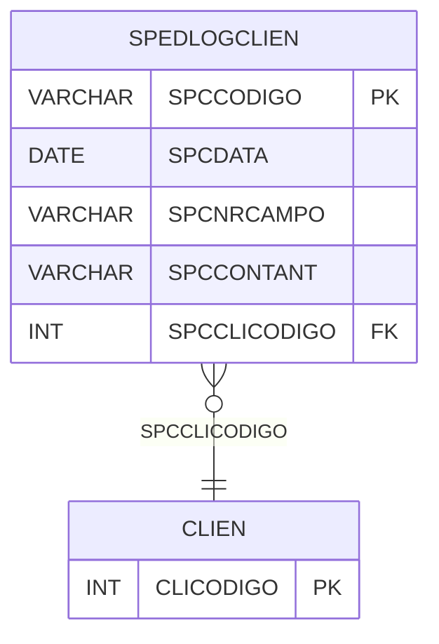

# SPEDLOGCLIEN - Documentação Completa de Relacionamentos

## 📊 Informações Gerais

- **Nome da Tabela**: SPEDLOGCLIEN (SPED Log Cliente)
- **Total de Registros**: 12.517
- **Total de Colunas**: 5
- **Chave Primária**: SPCCODIGO
- **Chaves Estrangeiras**: 1
- **Índices**: 0
- **Tabelas Dependentes**: 0
- **Banco de Dados**: Firebird

## 📝 Descrição

**SPEDLOGCLIEN** é uma tabela intermediária que armazena informações sobre log de alterações de clientes para o SPED Fiscal. Com **12.517 registros**, esta tabela registra alterações em campos de clientes que precisam ser exportadas para o SPED, incluindo código do log, data, número do campo, conteúdo anterior e código do cliente.

Esta tabela é essencial para:
- **SPED**: Gerenciar log de alterações de clientes para SPED
- **Auditoria**: Rastrear alterações de clientes
- **Rastreamento**: Rastrear alterações por cliente
- **Relatórios**: Gerar relatórios de log de alterações

---

## 🔑 Estrutura de Colunas

| Coluna | Tipo | Descrição |
|--------|------|-----------|
| **SPCCODIGO** 🔑 | VARCHAR(16) | Código do log (PK) |
| **SPCDATA** | DATE | Data da alteração |
| **SPCNRCAMPO** | VARCHAR(37) | Número do campo alterado |
| **SPCCONTANT** | VARCHAR(37) | Conteúdo anterior |
| **SPCCLICODIGO** 🔗 | INT | Código do cliente (FK → CLIEN) |

---

## 🔗 Relacionamentos - Nível 1 (Diretos)

### CLIEN - Cliente (FK Obrigatória)
**Volume:** Variável

**Relacionamento:**
```
SPEDLOGCLIEN.SPCCLICODIGO → CLIEN.CLICODIGO (N:1)
Constraint: CLIEN_SPEDLOGCLIEN
```

---

## 🗺️ Diagrama de Relacionamentos



---

## 💡 Exemplos de Uso

### Consulta Básica

```sql
SELECT SPCCODIGO, SPCDATA, SPCNRCAMPO, SPCCONTANT, SPCCLICODIGO
FROM SPEDLOGCLIEN
WHERE SPCCODIGO = ?;
```

---

## ⚡ Performance e Otimização

### Índices Recomendados

#### 1. Índice na Chave Primária (Já existe implicitamente)
```sql
-- Índice primário já existe implicitamente
```

#### 2. Índice em SPCCLICODIGO e SPCDATA
```sql
CREATE INDEX IDX_SPEDLOGCLIEN_CLI_DATA 
ON SPEDLOGCLIEN (SPCCLICODIGO, SPCDATA);
```

**Justificativa:** Facilita buscas por cliente e período.

---

## 📊 Estatísticas e Insights

- **Total de Registros**: 12.517
- **Logs de Alterações**: 12.517 registros de log de alterações de clientes

---

**Documentação gerada em**: 2025-01-27

**Banco de dados**: Firebird
