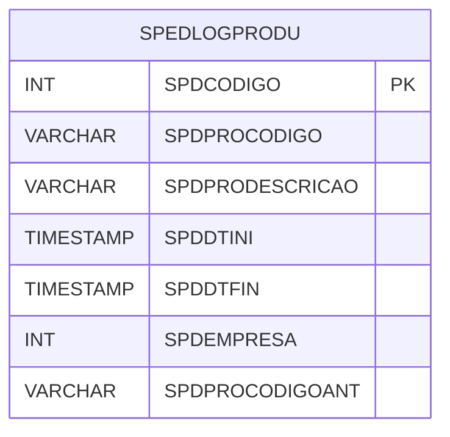

# SPEDLOGPRODU - Documentação Completa de Relacionamentos

## 📊 Informações Gerais

- **Nome da Tabela**: SPEDLOGPRODU (SPED Log Produto)
- **Total de Registros**: 63.636
- **Total de Colunas**: 7
- **Chave Primária**: SPDCODIGO
- **Chaves Estrangeiras**: 0
- **Índices**: 3
- **Tabelas Dependentes**: 0
- **Banco de Dados**: Firebird

## 📝 Descrição

**SPEDLOGPRODU** é uma tabela intermediária que armazena informações sobre log de alterações de produtos para o SPED Fiscal. Com **63.636 registros**, esta tabela registra alterações em produtos que precisam ser exportadas para o SPED, incluindo código do log, código do produto, descrição do produto, data inicial, data final, empresa e código do produto anterior.

Esta tabela é essencial para:
- **SPED**: Gerenciar log de alterações de produtos para SPED
- **Auditoria**: Rastrear alterações de produtos
- **Rastreamento**: Rastrear alterações por produto e período
- **Relatórios**: Gerar relatórios de log de alterações

---

## 🔑 Estrutura de Colunas

| Coluna | Tipo | Descrição |
|--------|------|-----------|
| **SPDCODIGO** 🔑 | INT | Código do log (PK) |
| **SPDPROCODIGO** | VARCHAR(37) | Código do produto |
| **SPDPRODESCRICAO** | VARCHAR(37) | Descrição do produto |
| **SPDDTINI** | TIMESTAMP | Data inicial |
| **SPDDTFIN** | TIMESTAMP | Data final |
| **SPDEMPRESA** | INT | Código da empresa |
| **SPDPROCODIGOANT** | VARCHAR(37) | Código do produto anterior |

---

## 📇 Índices

| Nome do Índice | Colunas | Único |
|----------------|---------|-------|
| INDSPDDTFIN | SPDDTFIN | Não |
| INDSPDDTINI | SPDDTINI | Não |
| INDSPDPROCODIGO | SPDPROCODIGO | Não |

---

## 🗺️ Diagrama de Relacionamentos



---

## 💡 Exemplos de Uso

### Consulta Básica

```sql
SELECT SPDCODIGO, SPDPROCODIGO, SPDPRODESCRICAO, SPDDTINI, SPDDTFIN, SPDEMPRESA, SPDPROCODIGOANT
FROM SPEDLOGPRODU
WHERE SPDCODIGO = ?;
```

---

## ⚡ Performance e Otimização

### Índices Recomendados

#### 1. Índice na Chave Primária (Já existe implicitamente)
```sql
-- Índice primário já existe implicitamente
```

#### 2. Índices Existentes
Os índices em SPDDTFIN, SPDDTINI e SPDPROCODIGO já estão criados e são adequados.

---

## 📊 Estatísticas e Insights

- **Total de Registros**: 63.636
- **Logs de Alterações**: 63.636 registros de log de alterações de produtos

---

**Documentação gerada em**: 2025-01-27

**Banco de dados**: Firebird
