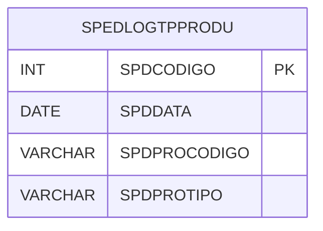

# SPEDLOGTPPRODU - Documentação Completa de Relacionamentos

## 📊 Informações Gerais

- **Nome da Tabela**: SPEDLOGTPPRODU (SPED Log Tipo Produto)
- **Total de Registros**: 5.213
- **Total de Colunas**: 4
- **Chave Primária**: SPDCODIGO
- **Chaves Estrangeiras**: 0
- **Índices**: 1
- **Tabelas Dependentes**: 0
- **Banco de Dados**: Firebird

## 📝 Descrição

**SPEDLOGTPPRODU** é uma tabela intermediária que armazena informações sobre log de alterações de tipo de produtos para o SPED Fiscal. Com **5.213 registros**, esta tabela registra alterações em tipos de produtos que precisam ser exportadas para o SPED, incluindo código do log, data, código do produto e tipo do produto.

Esta tabela é essencial para:
- **SPED**: Gerenciar log de alterações de tipo de produtos para SPED
- **Auditoria**: Rastrear alterações de tipo de produtos
- **Rastreamento**: Rastrear alterações por produto e data
- **Relatórios**: Gerar relatórios de log de alterações

---

## 🔑 Estrutura de Colunas

| Coluna | Tipo | Descrição |
|--------|------|-----------|
| **SPDCODIGO** 🔑 | INT | Código do log (PK) |
| **SPDDATA** | DATE | Data da alteração |
| **SPDPROCODIGO** | VARCHAR(37) | Código do produto |
| **SPDPROTIPO** | VARCHAR(37) | Tipo do produto |

---

## 📇 Índices

| Nome do Índice | Colunas | Único |
|----------------|---------|-------|
| IND_DATA_SPEDLOG | SPDDATA | Não |

---

## 🗺️ Diagrama de Relacionamentos



---

## 💡 Exemplos de Uso

### Consulta Básica

```sql
SELECT SPDCODIGO, SPDDATA, SPDPROCODIGO, SPDPROTIPO
FROM SPEDLOGTPPRODU
WHERE SPDCODIGO = ?;
```

---

## ⚡ Performance e Otimização

### Índices Recomendados

#### 1. Índice na Chave Primária (Já existe implicitamente)
```sql
-- Índice primário já existe implicitamente
```

#### 2. Índice Existente
O índice em SPDDATA já está criado e é adequado.

---

## 📊 Estatísticas e Insights

- **Total de Registros**: 5.213
- **Logs de Alterações**: 5.213 registros de log de alterações de tipo de produtos

---

**Documentação gerada em**: 2025-01-27

**Banco de dados**: Firebird
