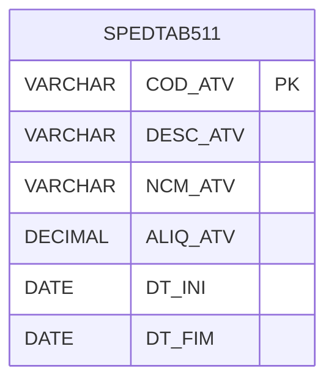

# SPEDTAB511 - Documentação Completa de Relacionamentos

## 📊 Informações Gerais

- **Nome da Tabela**: SPEDTAB511 (SPED Tabela 5.11 - Atividades)
- **Total de Registros**: 45
- **Total de Colunas**: 6
- **Chave Primária**: COD_ATV
- **Chaves Estrangeiras**: 0
- **Índices**: 0
- **Tabelas Dependentes**: 0
- **Banco de Dados**: Firebird

## 📝 Descrição

**SPEDTAB511** é uma tabela mestre que armazena informações sobre atividades econômicas para o SPED Fiscal (Tabela 5.11). Com **45 registros**, esta tabela registra atividades econômicas com seus códigos, descrições, NCM, alíquotas e períodos de vigência.

Esta tabela é essencial para:
- **SPED**: Gerenciar atividades econômicas para SPED Fiscal
- **Fiscal**: Controlar atividades econômicas
- **Rastreamento**: Rastrear atividades cadastradas
- **Relatórios**: Gerar relatórios de atividades

---

## 🔑 Estrutura de Colunas

| Coluna | Tipo | Descrição |
|--------|------|-----------|
| **COD_ATV** 🔑 | VARCHAR(14) | Código da atividade (PK) |
| **DESC_ATV** | VARCHAR(14) | Descrição da atividade |
| **NCM_ATV** | VARCHAR(14) | NCM da atividade |
| **ALIQ_ATV** | DECIMAL(18,2) | Alíquota da atividade |
| **DT_INI** | DATE | Data inicial de vigência |
| **DT_FIM** | DATE | Data final de vigência |

---

## 🗺️ Diagrama de Relacionamentos



---

## 💡 Exemplos de Uso

### Consulta Básica

```sql
SELECT COD_ATV, DESC_ATV, NCM_ATV, ALIQ_ATV, DT_INI, DT_FIM
FROM SPEDTAB511
WHERE COD_ATV = ?;
```

---

## ⚡ Performance e Otimização

### Índices Recomendados

#### 1. Índice na Chave Primária (Já existe implicitamente)
```sql
-- Índice primário já existe implicitamente
```

---

## 📊 Estatísticas e Insights

- **Total de Registros**: 45
- **Atividades**: 45 atividades econômicas cadastradas

---

**Documentação gerada em**: 2025-01-27

**Banco de dados**: Firebird
