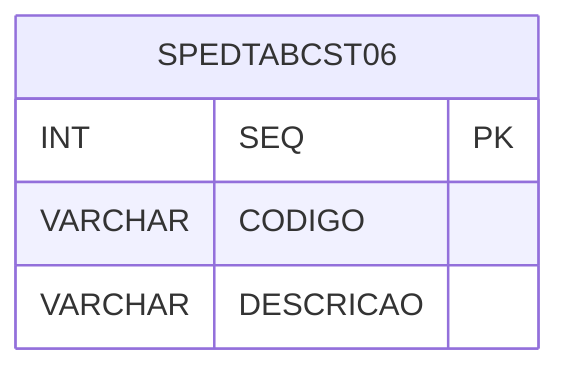

# SPEDTABCST06 - Documentação Completa de Relacionamentos

## 📊 Informações Gerais

- **Nome da Tabela**: SPEDTABCST06 (SPED Tabela CST 06)
- **Total de Registros**: 72
- **Total de Colunas**: 3
- **Chave Primária**: SEQ
- **Chaves Estrangeiras**: 0
- **Índices**: 0
- **Tabelas Dependentes**: 0
- **Banco de Dados**: Firebird

## 📝 Descrição

**SPEDTABCST06** é uma tabela mestre que armazena informações sobre códigos de situação tributária (CST) 06 para o SPED Fiscal. Com **72 registros**, esta tabela registra códigos CST 06 com suas descrições para uso no SPED Fiscal.

Esta tabela é essencial para:
- **SPED**: Gerenciar códigos CST 06 para SPED Fiscal
- **Fiscal**: Controlar códigos de situação tributária
- **Rastreamento**: Rastrear códigos cadastrados
- **Relatórios**: Gerar relatórios de códigos CST

---

## 🔑 Estrutura de Colunas

| Coluna | Tipo | Descrição |
|--------|------|-----------|
| **SEQ** 🔑 | INT | Sequencial (PK) |
| **CODIGO** | VARCHAR(37) | Código CST |
| **DESCRICAO** | VARCHAR(14) | Descrição do CST |

---

## 🗺️ Diagrama de Relacionamentos



---

## 💡 Exemplos de Uso

### Consulta Básica

```sql
SELECT SEQ, CODIGO, DESCRICAO
FROM SPEDTABCST06
WHERE SEQ = ?;
```

---

## ⚡ Performance e Otimização

### Índices Recomendados

#### 1. Índice na Chave Primária (Já existe implicitamente)
```sql
-- Índice primário já existe implicitamente
```

---

## 📊 Estatísticas e Insights

- **Total de Registros**: 72
- **Códigos CST 06**: 72 códigos CST 06 cadastrados

---

**Documentação gerada em**: 2025-01-27

**Banco de dados**: Firebird
