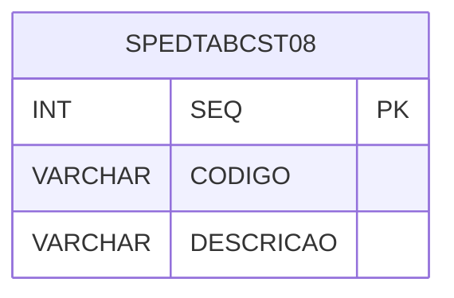

# SPEDTABCST08 - Documentação Completa de Relacionamentos

## 📊 Informações Gerais

- **Nome da Tabela**: SPEDTABCST08 (SPED Tabela CST 08)
- **Total de Registros**: 9
- **Total de Colunas**: 3
- **Chave Primária**: SEQ
- **Chaves Estrangeiras**: 0
- **Índices**: 0
- **Tabelas Dependentes**: 0
- **Banco de Dados**: Firebird

## 📝 Descrição

**SPEDTABCST08** é uma tabela mestre que armazena códigos CST (Código de Situação Tributária) para SPED Fiscal, especificamente para CST 08. Com apenas **9 registros**, esta tabela define códigos e descrições de CST 08 utilizados na escrituração fiscal digital.

Esta tabela é essencial para:
- **SPED Fiscal**: Gerenciar códigos CST 08 para SPED
- **Fiscal**: Classificar operações fiscais por CST 08
- **Rastreamento**: Rastrear códigos CST 08 disponíveis
- **Relatórios**: Gerar relatórios SPED por CST 08

---

## 🔑 Estrutura de Colunas

| Coluna | Tipo | Descrição |
|--------|------|-----------|
| **SEQ** 🔑 | INT | Sequencial único (PK) |
| **CODIGO** | VARCHAR(37) | Código CST 08 |
| **DESCRICAO** | VARCHAR(14) | Descrição do código |

---

## 🗺️ Diagrama de Relacionamentos



---

## 💡 Exemplos de Uso

### Consulta Básica

```sql
SELECT SEQ, CODIGO, DESCRICAO
FROM SPEDTABCST08
WHERE SEQ = ?;
```

---

## ⚡ Performance e Otimização

### Índices Recomendados

#### 1. Índice na Chave Primária (Já existe implicitamente)
```sql
-- Índice primário já existe implicitamente
```

---

## 📊 Estatísticas e Insights

- **Total de Registros**: 9
- **Códigos CST 08**: 9 códigos CST 08 cadastrados

---

**Documentação gerada em**: 2025-01-27

**Banco de dados**: Firebird

