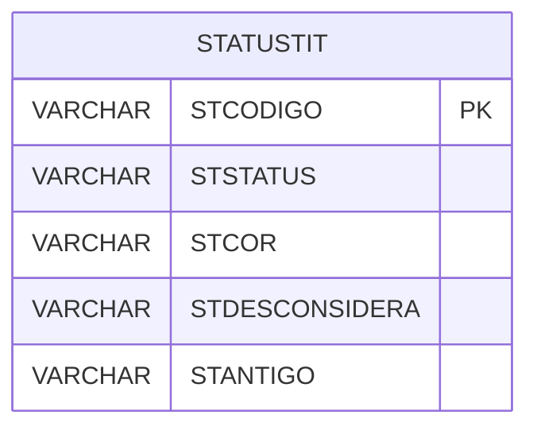

# STATUSTIT - Documentação Completa de Relacionamentos

## 📊 Informações Gerais

- **Nome da Tabela**: STATUSTIT (Status Título)
- **Total de Registros**: 5
- **Total de Colunas**: 5
- **Chave Primária**: STCODIGO
- **Chaves Estrangeiras**: 0
- **Índices**: 0
- **Tabelas Dependentes**: 0
- **Banco de Dados**: Firebird

## 📝 Descrição

**STATUSTIT** é uma tabela mestre que armazena informações sobre status de títulos. Com apenas **5 registros**, esta tabela define status disponíveis para títulos financeiros, incluindo código, status, cor, flag de desconsiderar e flag de antigo.

Esta tabela é essencial para:
- **Títulos**: Gerenciar status de títulos financeiros
- **Controle**: Controlar status disponíveis
- **Rastreamento**: Rastrear status cadastrados
- **Relatórios**: Gerar relatórios de status

---

## 🔑 Estrutura de Colunas

| Coluna | Tipo | Descrição |
|--------|------|-----------|
| **STCODIGO** 🔑 | VARCHAR(14) | Código do status (PK) |
| **STSTATUS** | VARCHAR(37) | Descrição do status |
| **STCOR** | VARCHAR(37) | Cor do status |
| **STDESCONSIDERA** | VARCHAR(14) | Desconsidera |
| **STANTIGO** | VARCHAR(14) | Antigo |

---

## 🗺️ Diagrama de Relacionamentos



---

## 💡 Exemplos de Uso

### Consulta Básica

```sql
SELECT STCODIGO, STSTATUS, STCOR, STDESCONSIDERA, STANTIGO
FROM STATUSTIT
WHERE STCODIGO = ?;
```

---

## ⚡ Performance e Otimização

### Índices Recomendados

#### 1. Índice na Chave Primária (Já existe implicitamente)
```sql
-- Índice primário já existe implicitamente
```

---

## 📊 Estatísticas e Insights

- **Total de Registros**: 5
- **Status**: 5 status de títulos cadastrados

---

**Documentação gerada em**: 2025-01-27

**Banco de dados**: Firebird
