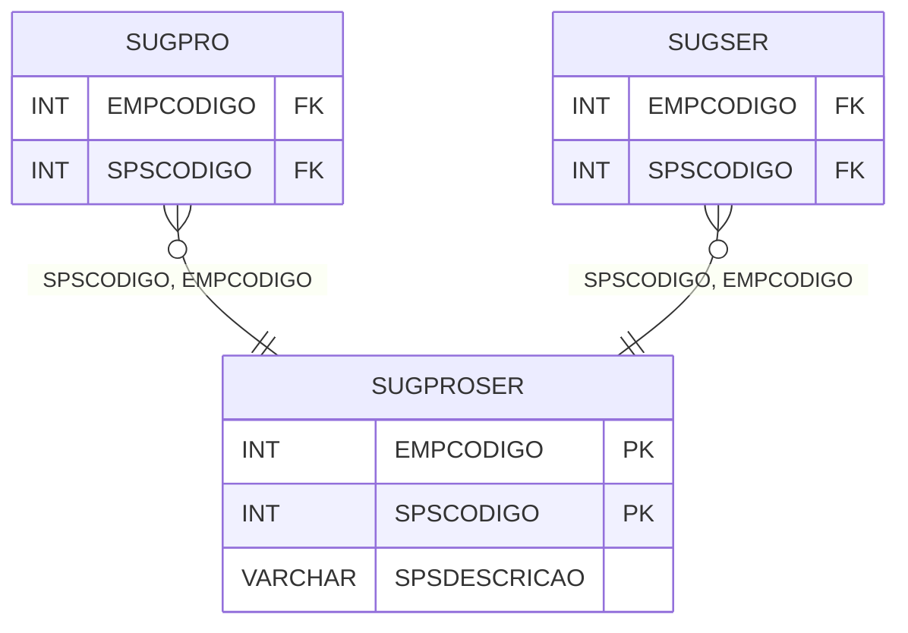

# SUGPROSER - Documentação Completa de Relacionamentos

## 📊 Informações Gerais

- **Nome da Tabela**: SUGPROSER (Sugestão Produto Serviço)
- **Total de Registros**: 53
- **Total de Colunas**: 3
- **Chave Primária**: EMPCODIGO, SPSCODIGO (composite)
- **Chaves Estrangeiras**: 0
- **Índices**: 0
- **Tabelas Dependentes**: 14
- **Banco de Dados**: Firebird

## 📝 Descrição

**SUGPROSER** é uma tabela mestre que armazena informações sobre sugestões de produtos/serviços. Com **53 registros**, esta tabela é referenciada por **14 outras tabelas**, sendo uma tabela importante para o sistema de sugestões. Armazena informações sobre sugestões, incluindo empresa, código da sugestão e descrição.

Esta tabela é essencial para:
- **Sugestões**: Gerenciar sugestões de produtos/serviços
- **Rastreamento**: Rastrear sugestões disponíveis
- **Relatórios**: Gerar relatórios de sugestões

---

## 🔑 Estrutura de Colunas

| Coluna | Tipo | Descrição |
|--------|------|-----------|
| **EMPCODIGO** 🔑 | INT | Código da empresa (PK) |
| **SPSCODIGO** 🔑 | INT | Código da sugestão (PK) |
| **SPSDESCRICAO** | VARCHAR(37) | Descrição da sugestão |

---

## 📊 Tabelas que Referenciam Esta

Esta tabela é referenciada por 14 tabelas, incluindo:

### SUGPRO - Sugestão Produto
**Volume:** 268 registros

**Relacionamento:**
```
SUGPRO.SPSCODIGO → SUGPROSER.SPSCODIGO (N:1)
SUGPRO.EMPCODIGO → SUGPROSER.EMPCODIGO (N:1)
Constraint: SUGPRO_SUGPROSER
```

### SUGSER - Sugestão Serviço
**Volume:** Variável

**Relacionamento:**
```
SUGSER.SPSCODIGO → SUGPROSER.SPSCODIGO (N:1)
SUGSER.EMPCODIGO → SUGPROSER.EMPCODIGO (N:1)
Constraint: SUGSER_SUGPROSER
```

---

## 🗺️ Diagrama de Relacionamentos



---

## 💡 Exemplos de Uso

### Consulta Básica

```sql
SELECT EMPCODIGO, SPSCODIGO, SPSDESCRICAO
FROM SUGPROSER
WHERE EMPCODIGO = ? AND SPSCODIGO = ?;
```

---

## ⚡ Performance e Otimização

### Índices Recomendados

#### 1. Índice Composto na Chave Primária (Já existe implicitamente)
```sql
-- Índice primário já existe implicitamente
```

---

## 📊 Estatísticas e Insights

- **Total de Registros**: 53
- **Sugestões**: 53 sugestões de produtos/serviços cadastradas
- **Referências**: Referenciada por 14 outras tabelas

---

**Documentação gerada em**: 2025-01-27

**Banco de dados**: Firebird
