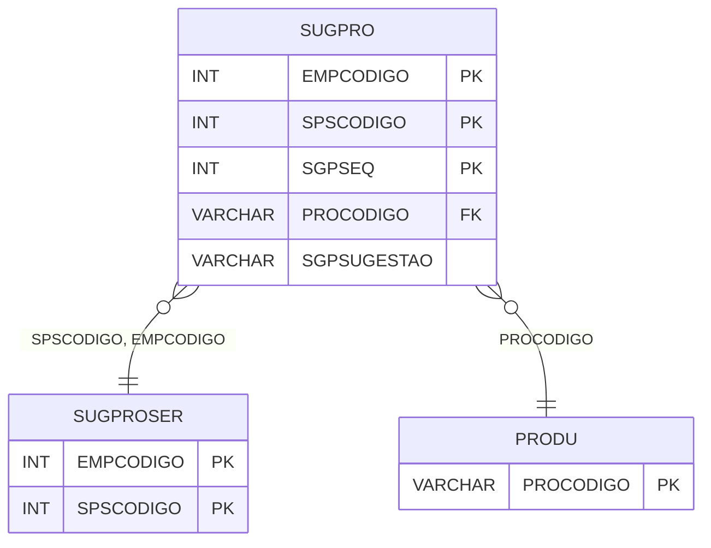

# SUGPRO - Documentação Completa de Relacionamentos

## 📊 Informações Gerais

- **Nome da Tabela**: SUGPRO (Sugestão Produto)
- **Total de Registros**: 268
- **Total de Colunas**: 5
- **Chave Primária**: EMPCODIGO, SPSCODIGO, SGPSEQ (composite)
- **Chaves Estrangeiras**: 3
- **Índices**: 0
- **Tabelas Dependentes**: 0
- **Banco de Dados**: Firebird

## 📝 Descrição

**SUGPRO** é uma tabela intermediária que armazena informações sobre sugestões de produtos. Com **268 registros**, esta tabela registra produtos sugeridos para sugestões de produtos/serviços, incluindo empresa, código da sugestão, sequencial, produto e tipo de sugestão.

Esta tabela é essencial para:
- **Sugestões**: Gerenciar sugestões de produtos
- **Rastreamento**: Rastrear produtos sugeridos por sugestão
- **Relatórios**: Gerar relatórios de sugestões

---

## 🔑 Estrutura de Colunas

| Coluna | Tipo | Descrição |
|--------|------|-----------|
| **EMPCODIGO** 🔑 🔗 | INT | Código da empresa (PK, FK → SUGPROSER) |
| **SPSCODIGO** 🔑 🔗 | INT | Código da sugestão (PK, FK → SUGPROSER) |
| **SGPSEQ** 🔑 | INT | Sequencial (PK) |
| **PROCODIGO** 🔗 | VARCHAR(14) | Código do produto (FK → PRODU) |
| **SGPSUGESTAO** | VARCHAR(14) | Tipo de sugestão |

---

## 🔗 Relacionamentos - Nível 1 (Diretos)

### SUGPROSER - Sugestão Produto Serviço (FK Obrigatória)
**Volume:** 53 registros

**Relacionamento:**
```
SUGPRO.SPSCODIGO → SUGPROSER.SPSCODIGO (N:1)
SUGPRO.EMPCODIGO → SUGPROSER.EMPCODIGO (N:1)
Constraint: SUGPRO_SUGPROSER
```

### PRODU - Produto (FK Obrigatória)
**Volume:** Variável

**Relacionamento:**
```
SUGPRO.PROCODIGO → PRODU.PROCODIGO (N:1)
Constraint: SUGPRO_PRODU
```

---

## 🗺️ Diagrama de Relacionamentos



---

## 💡 Exemplos de Uso

### Consulta Básica

```sql
SELECT EMPCODIGO, SPSCODIGO, SGPSEQ, PROCODIGO, SGPSUGESTAO
FROM SUGPRO
WHERE EMPCODIGO = ? AND SPSCODIGO = ? AND SGPSEQ = ?;
```

---

## ⚡ Performance e Otimização

### Índices Recomendados

#### 1. Índice Composto na Chave Primária (Já existe implicitamente)
```sql
-- Índice primário já existe implicitamente
```

---

## 📊 Estatísticas e Insights

- **Total de Registros**: 268
- **Sugestões**: 268 produtos sugeridos

---

**Documentação gerada em**: 2025-01-27

**Banco de dados**: Firebird
