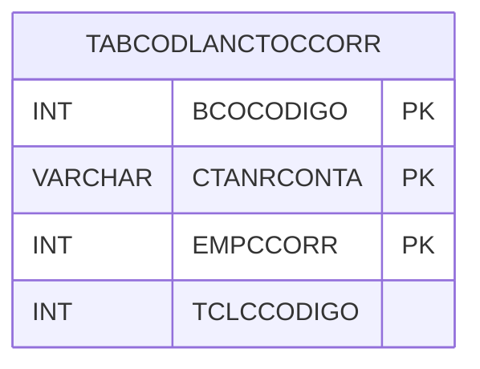

# TABCODLANCTOCCORR - Documentação Completa de Relacionamentos

## 📊 Informações Gerais

- **Nome da Tabela**: TABCODLANCTOCCORR (Tabela Código Lançamento Conta Corrente)
- **Total de Registros**: 80
- **Total de Colunas**: 4
- **Chave Primária**: BCOCODIGO, CTANRCONTA, EMPCCORR (composite)
- **Chaves Estrangeiras**: 0
- **Índices**: 0
- **Tabelas Dependentes**: 0
- **Banco de Dados**: Firebird

## 📝 Descrição

**TABCODLANCTOCCORR** é uma tabela intermediária que armazena informações sobre códigos de lançamento para contas correntes. Com **80 registros**, esta tabela registra códigos de lançamento associados a contas correntes, incluindo banco, número da conta, empresa conta corrente e código do lançamento.

Esta tabela é essencial para:
- **Lançamentos**: Gerenciar códigos de lançamento por conta corrente
- **Controle**: Controlar códigos por banco e conta
- **Rastreamento**: Rastrear códigos cadastrados
- **Relatórios**: Gerar relatórios de códigos

---

## 🔑 Estrutura de Colunas

| Coluna | Tipo | Descrição |
|--------|------|-----------|
| **BCOCODIGO** 🔑 | INT | Código do banco (PK) |
| **CTANRCONTA** 🔑 | VARCHAR(37) | Número da conta (PK) |
| **EMPCCORR** 🔑 | INT | Empresa conta corrente (PK) |
| **TCLCCODIGO** | INT | Código do lançamento |

---

## 🗺️ Diagrama de Relacionamentos



---

## 💡 Exemplos de Uso

### Consulta Básica

```sql
SELECT BCOCODIGO, CTANRCONTA, EMPCCORR, TCLCCODIGO
FROM TABCODLANCTOCCORR
WHERE BCOCODIGO = ? AND CTANRCONTA = ? AND EMPCCORR = ?;
```

---

## ⚡ Performance e Otimização

### Índices Recomendados

#### 1. Índice Composto na Chave Primária (Já existe implicitamente)
```sql
-- Índice primário já existe implicitamente
```

---

## 📊 Estatísticas e Insights

- **Total de Registros**: 80
- **Códigos**: 80 códigos de lançamento para contas correntes

---

**Documentação gerada em**: 2025-01-27

**Banco de dados**: Firebird

