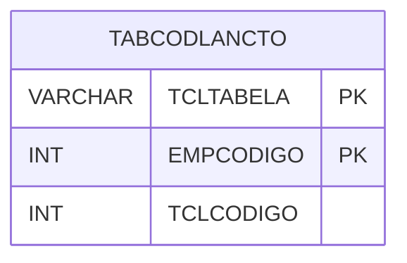

# TABCODLANCTO - Documentação Completa de Relacionamentos

## 📊 Informações Gerais

- **Nome da Tabela**: TABCODLANCTO (Tabela Código Lançamento)
- **Total de Registros**: 44
- **Total de Colunas**: 3
- **Chave Primária**: TCLTABELA, EMPCODIGO (composite)
- **Chaves Estrangeiras**: 0
- **Índices**: 0
- **Tabelas Dependentes**: 0
- **Banco de Dados**: Firebird

## 📝 Descrição

**TABCODLANCTO** é uma tabela intermediária que armazena informações sobre códigos de lançamento por tabela e empresa. Com **44 registros**, esta tabela registra códigos de lançamento associados a diferentes tabelas do sistema, incluindo nome da tabela, empresa e código do lançamento.

Esta tabela é essencial para:
- **Lançamentos**: Gerenciar códigos de lançamento por tabela
- **Controle**: Controlar códigos por empresa e tabela
- **Rastreamento**: Rastrear códigos cadastrados
- **Relatórios**: Gerar relatórios de códigos

---

## 🔑 Estrutura de Colunas

| Coluna | Tipo | Descrição |
|--------|------|-----------|
| **TCLTABELA** 🔑 | VARCHAR(37) | Nome da tabela (PK) |
| **EMPCODIGO** 🔑 | INT | Código da empresa (PK) |
| **TCLCODIGO** | INT | Código do lançamento |

---

## 🗺️ Diagrama de Relacionamentos



---

## 💡 Exemplos de Uso

### Consulta Básica

```sql
SELECT TCLTABELA, EMPCODIGO, TCLCODIGO
FROM TABCODLANCTO
WHERE TCLTABELA = ? AND EMPCODIGO = ?;
```

---

## ⚡ Performance e Otimização

### Índices Recomendados

#### 1. Índice Composto na Chave Primária (Já existe implicitamente)
```sql
-- Índice primário já existe implicitamente
```

---

## 📊 Estatísticas e Insights

- **Total de Registros**: 44
- **Códigos**: 44 códigos de lançamento cadastrados

---

**Documentação gerada em**: 2025-01-27

**Banco de dados**: Firebird

