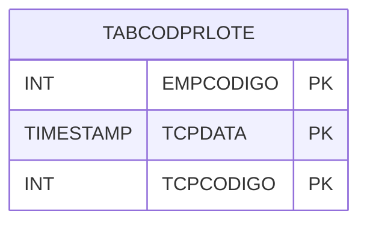

# TABCODPRLOTE - Documentação Completa de Relacionamentos

## 📊 Informações Gerais

- **Nome da Tabela**: TABCODPRLOTE (Tabela Código Produto Lote)
- **Total de Registros**: 1
- **Total de Colunas**: 3
- **Chave Primária**: EMPCODIGO, TCPDATA, TCPCODIGO (composite)
- **Chaves Estrangeiras**: 0
- **Índices**: 0
- **Tabelas Dependentes**: 0
- **Banco de Dados**: Firebird

## 📝 Descrição

**TABCODPRLOTE** é uma tabela de configuração que armazena informações sobre códigos de produtos por lote. Com apenas **1 registro**, esta tabela registra códigos de produtos associados a lotes, incluindo empresa, data e código.

Esta tabela é essencial para:
- **Lotes**: Gerenciar códigos de produtos por lote
- **Controle**: Controlar códigos por empresa e data
- **Rastreamento**: Rastrear códigos cadastrados
- **Relatórios**: Gerar relatórios de códigos

---

## 🔑 Estrutura de Colunas

| Coluna | Tipo | Descrição |
|--------|------|-----------|
| **EMPCODIGO** 🔑 | INT | Código da empresa (PK) |
| **TCPDATA** 🔑 | TIMESTAMP | Data (PK) |
| **TCPCODIGO** 🔑 | INT | Código (PK) |

---

## 🗺️ Diagrama de Relacionamentos



---

## 💡 Exemplos de Uso

### Consulta Básica

```sql
SELECT EMPCODIGO, TCPDATA, TCPCODIGO
FROM TABCODPRLOTE
WHERE EMPCODIGO = ? AND TCPDATA = ? AND TCPCODIGO = ?;
```

---

## ⚡ Performance e Otimização

### Índices Recomendados

#### 1. Índice Composto na Chave Primária (Já existe implicitamente)
```sql
-- Índice primário já existe implicitamente
```

---

## 📊 Estatísticas e Insights

- **Total de Registros**: 1
- **Uso**: Tabela de configuração com volume mínimo

---

**Documentação gerada em**: 2025-01-27

**Banco de dados**: Firebird

