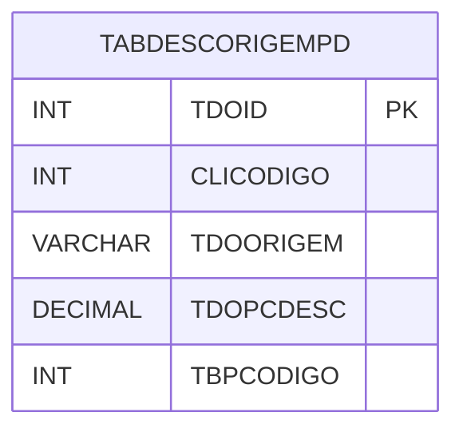

# TABDESCORIGEMPD - Documentação Completa de Relacionamentos

## 📊 Informações Gerais

- **Nome da Tabela**: TABDESCORIGEMPD (Tabela Desconto Origem Pedido)
- **Total de Registros**: 8.817
- **Total de Colunas**: 5
- **Chave Primária**: TDOID
- **Chaves Estrangeiras**: 0
- **Índices**: 1
- **Tabelas Dependentes**: 0
- **Banco de Dados**: Firebird

## 📝 Descrição

**TABDESCORIGEMPD** é uma tabela intermediária que armazena informações sobre descontos por origem de pedido. Com **8.817 registros**, esta tabela registra descontos aplicados a pedidos baseados na origem, incluindo cliente, origem, percentual de desconto e código da tabela de preço.

Esta tabela é essencial para:
- **Descontos**: Gerenciar descontos por origem de pedido
- **Controle**: Controlar descontos por cliente e origem
- **Rastreamento**: Rastrear descontos aplicados
- **Relatórios**: Gerar relatórios de descontos

---

## 🔑 Estrutura de Colunas

| Coluna | Tipo | Descrição |
|--------|------|-----------|
| **TDOID** 🔑 | INT | ID do desconto (PK) |
| **CLICODIGO** | INT | Código do cliente |
| **TDOORIGEM** | VARCHAR(14) | Origem do pedido |
| **TDOPCDESC** | DECIMAL(18,2) | Percentual de desconto |
| **TBPCODIGO** | INT | Código da tabela de preço |

---

## 📇 Índices

| Nome do Índice | Colunas | Único |
|----------------|---------|-------|
| IND_TDOORIGEM_CLICODIGO | CLICODIGO, TDOORIGEM | Sim |

---

## 🗺️ Diagrama de Relacionamentos



---

## 💡 Exemplos de Uso

### Consulta Básica

```sql
SELECT TDOID, CLICODIGO, TDOORIGEM, TDOPCDESC, TBPCODIGO
FROM TABDESCORIGEMPD
WHERE TDOID = ?;
```

---

## ⚡ Performance e Otimização

### Índices Recomendados

#### 1. Índice na Chave Primária (Já existe implicitamente)
```sql
-- Índice primário já existe implicitamente
```

#### 2. Índice Existente
O índice único em CLICODIGO e TDOORIGEM já está criado e é adequado.

---

## 📊 Estatísticas e Insights

- **Total de Registros**: 8.817
- **Descontos**: 8.817 registros de descontos por origem de pedido

---

**Documentação gerada em**: 2025-01-27

**Banco de dados**: Firebird

