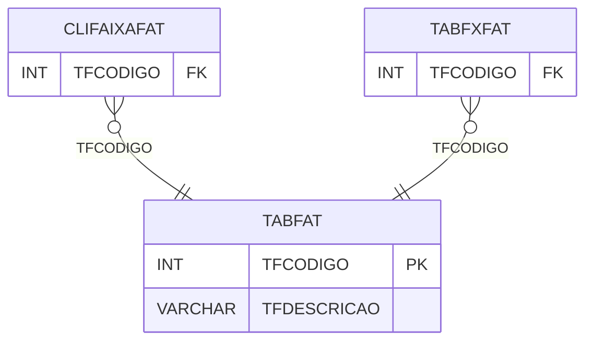

# TABFAT - Documentação Completa de Relacionamentos

## 📊 Informações Gerais

- **Nome da Tabela**: TABFAT (Tabela Faturamento)
- **Total de Registros**: 2
- **Total de Colunas**: 2
- **Chave Primária**: TFCODIGO
- **Chaves Estrangeiras**: 0
- **Índices**: 0
- **Tabelas Dependentes**: 2
- **Banco de Dados**: Firebird

## 📝 Descrição

**TABFAT** é uma tabela mestre que armazena informações sobre tabelas de faturamento. Com apenas **2 registros**, esta tabela define tipos de tabelas de faturamento disponíveis no sistema, incluindo código e descrição.

Esta tabela é essencial para:
- **Faturamento**: Gerenciar tabelas de faturamento
- **Controle**: Controlar tipos de faturamento disponíveis
- **Rastreamento**: Rastrear tabelas cadastradas
- **Relatórios**: Gerar relatórios de faturamento

---

## 🔑 Estrutura de Colunas

| Coluna | Tipo | Descrição |
|--------|------|-----------|
| **TFCODIGO** 🔑 | INT | Código da tabela de faturamento (PK) |
| **TFDESCRICAO** | VARCHAR(37) | Descrição da tabela |

---

## 📊 Tabelas que Referenciam Esta

Esta tabela é referenciada por 2 tabelas:

### CLIFAIXAFAT - Cliente Faixa Faturamento
**Volume:** Variável

**Relacionamento:**
```
CLIFAIXAFAT.TFCODIGO → TABFAT.TFCODIGO (N:1)
Constraint: XFK_CLIFAIXAFAT_TABFAT
```

### TABFXFAT - Tabela Faixa Faturamento
**Volume:** 5 registros

**Relacionamento:**
```
TABFXFAT.TFCODIGO → TABFAT.TFCODIGO (N:1)
Constraint: TABFAT_TABFXFAT
```

---

## 🗺️ Diagrama de Relacionamentos



---

## 💡 Exemplos de Uso

### Consulta Básica

```sql
SELECT TFCODIGO, TFDESCRICAO
FROM TABFAT
WHERE TFCODIGO = ?;
```

---

## ⚡ Performance e Otimização

### Índices Recomendados

#### 1. Índice na Chave Primária (Já existe implicitamente)
```sql
-- Índice primário já existe implicitamente
```

---

## 📊 Estatísticas e Insights

- **Total de Registros**: 2
- **Tabelas de Faturamento**: 2 tabelas de faturamento cadastradas

---

**Documentação gerada em**: 2025-01-27

**Banco de dados**: Firebird

