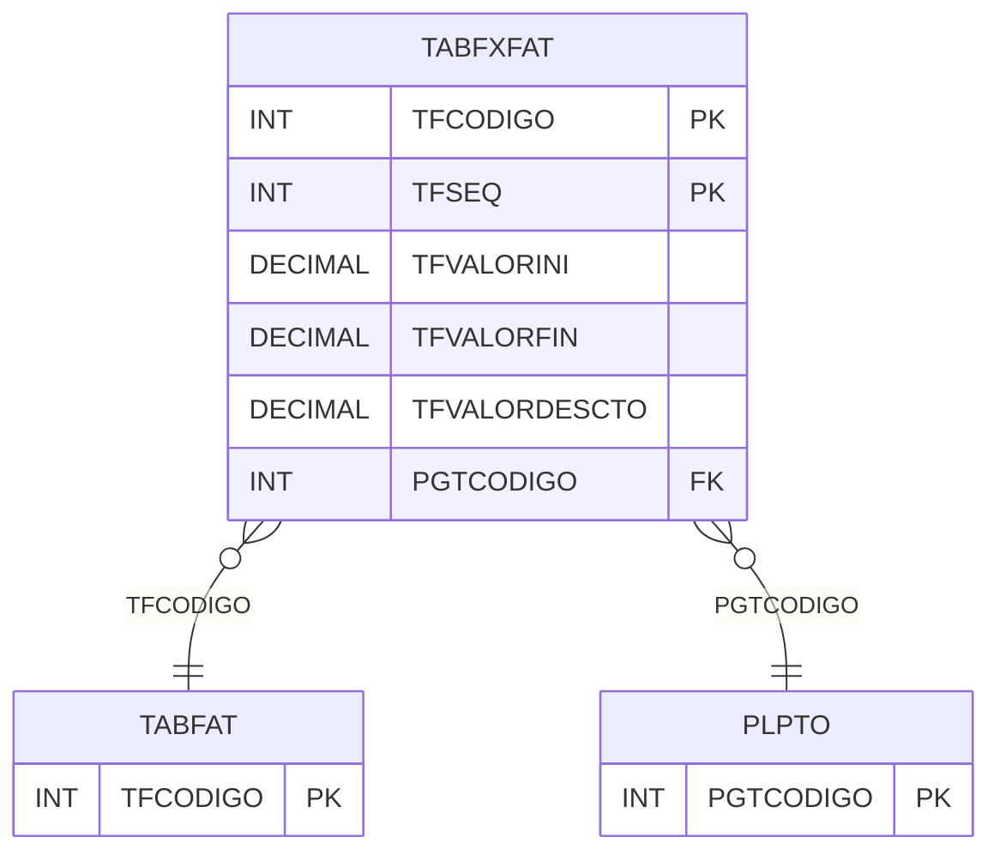

# TABFXFAT - Documentação Completa de Relacionamentos

## 📊 Informações Gerais

- **Nome da Tabela**: TABFXFAT (Tabela Faixa Faturamento)
- **Total de Registros**: 5
- **Total de Colunas**: 6
- **Chave Primária**: TFCODIGO, TFSEQ (composite)
- **Chaves Estrangeiras**: 2
- **Índices**: 0
- **Tabelas Dependentes**: 0
- **Banco de Dados**: Firebird

## 📝 Descrição

**TABFXFAT** é uma tabela intermediária que armazena informações sobre faixas de faturamento. Com **5 registros**, esta tabela registra faixas de valores para tabelas de faturamento, incluindo código da tabela, sequencial, valor inicial, valor final, valor de desconto e código do plano de pagamento.

Esta tabela é essencial para:
- **Faturamento**: Gerenciar faixas de faturamento
- **Controle**: Controlar faixas de valores por tabela
- **Rastreamento**: Rastrear faixas cadastradas
- **Relatórios**: Gerar relatórios de faixas

---

## 🔑 Estrutura de Colunas

| Coluna | Tipo | Descrição |
|--------|------|-----------|
| **TFCODIGO** 🔑 🔗 | INT | Código da tabela de faturamento (PK, FK → TABFAT) |
| **TFSEQ** 🔑 | INT | Sequencial (PK) |
| **TFVALORINI** | DECIMAL(18,2) | Valor inicial |
| **TFVALORFIN** | DECIMAL(18,2) | Valor final |
| **TFVALORDESCTO** | DECIMAL(18,2) | Valor de desconto |
| **PGTCODIGO** 🔗 | INT | Código do plano de pagamento (FK → PLPTO) |

---

## 🔗 Relacionamentos - Nível 1 (Diretos)

### TABFAT - Tabela Faturamento (FK Obrigatória)
**Volume:** 2 registros

**Relacionamento:**
```
TABFXFAT.TFCODIGO → TABFAT.TFCODIGO (N:1)
Constraint: TABFAT_TABFXFAT
```

### PLPTO - Plano Pagamento (FK Opcional)
**Volume:** Variável

**Relacionamento:**
```
TABFXFAT.PGTCODIGO → PLPTO.PGTCODIGO (N:1)
Constraint: PLPTO_TABFXFAT
```

---

## 🗺️ Diagrama de Relacionamentos



---

## 💡 Exemplos de Uso

### Consulta Básica

```sql
SELECT TFCODIGO, TFSEQ, TFVALORINI, TFVALORFIN, TFVALORDESCTO, PGTCODIGO
FROM TABFXFAT
WHERE TFCODIGO = ? AND TFSEQ = ?;
```

---

## ⚡ Performance e Otimização

### Índices Recomendados

#### 1. Índice Composto na Chave Primária (Já existe implicitamente)
```sql
-- Índice primário já existe implicitamente
```

---

## 📊 Estatísticas e Insights

- **Total de Registros**: 5
- **Faixas**: 5 faixas de faturamento cadastradas

---

**Documentação gerada em**: 2025-01-27

**Banco de dados**: Firebird

