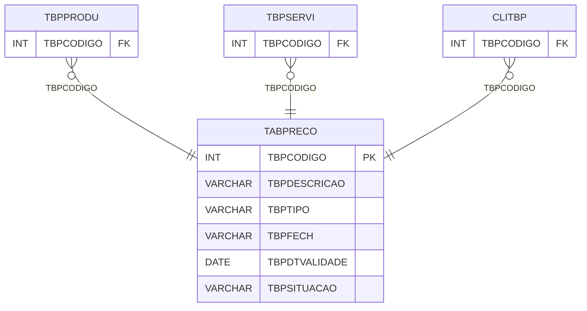

# TABPRECO - Documentação Completa de Relacionamentos

## 📊 Informações Gerais

- **Nome da Tabela**: TABPRECO (Tabela Preço)
- **Total de Registros**: 112
- **Total de Colunas**: 8
- **Chave Primária**: TBPCODIGO
- **Chaves Estrangeiras**: 0
- **Índices**: 0
- **Tabelas Dependentes**: 13
- **Banco de Dados**: Firebird

## 📝 Descrição

**TABPRECO** é uma tabela mestre que armazena informações sobre tabelas de preços. Com **112 registros**, esta tabela é referenciada por **13 outras tabelas**, sendo uma tabela central para gestão de preços. Armazena informações sobre tabelas de preços, incluindo código, descrição, tipo, flag de fechamento, data de validade, situação, flag de tabela combinada e data de início.

Esta tabela é essencial para:
- **Preços**: Gerenciar tabelas de preços
- **Controle**: Controlar tabelas de preços disponíveis
- **Rastreamento**: Rastrear tabelas cadastradas
- **Relatórios**: Gerar relatórios de preços

---

## 🔑 Estrutura de Colunas

| Coluna | Tipo | Descrição |
|--------|------|-----------|
| **TBPCODIGO** 🔑 | INT | Código da tabela de preço (PK) |
| **TBPDESCRICAO** | VARCHAR(37) | Descrição da tabela |
| **TBPTIPO** | VARCHAR(14) | Tipo da tabela |
| **TBPFECH** | VARCHAR(14) | Fechamento |
| **TBPDTVALIDADE** | DATE | Data de validade |
| **TBPSITUACAO** | VARCHAR(14) | Situação |
| **TBPTABCOMB** | VARCHAR(14) | Tabela combinada |
| **TBPDTINICIO** | DATE | Data de início |

---

## 📊 Tabelas que Referenciam Esta

Esta tabela é referenciada por 13 tabelas, incluindo:

### TBPPRODU - Tabela Preço Produto
**Volume:** Variável

**Relacionamento:**
```
TBPPRODU.TBPCODIGO → TABPRECO.TBPCODIGO (N:1)
Constraint: TABPRECO_TBPPRODU
```

### TBPSERVI - Tabela Preço Serviço
**Volume:** Variável

**Relacionamento:**
```
TBPSERVI.TBPCODIGO → TABPRECO.TBPCODIGO (N:1)
Constraint: TABPRECO_TBPSERVI
```

### CLITBP - Cliente Tabela Preço
**Volume:** Variável

**Relacionamento:**
```
CLITBP.TBPCODIGO → TABPRECO.TBPCODIGO (N:1)
Constraint: TABPRECO_CLITBP
```

---

## 🗺️ Diagrama de Relacionamentos



---

## 💡 Exemplos de Uso

### Consulta Básica

```sql
SELECT TBPCODIGO, TBPDESCRICAO, TBPTIPO, TBPFECH, TBPDTVALIDADE, TBPSITUACAO, TBPTABCOMB, TBPDTINICIO
FROM TABPRECO
WHERE TBPCODIGO = ?;
```

---

## ⚡ Performance e Otimização

### Índices Recomendados

#### 1. Índice na Chave Primária (Já existe implicitamente)
```sql
-- Índice primário já existe implicitamente
```

---

## 📊 Estatísticas e Insights

- **Total de Registros**: 112
- **Tabelas de Preço**: 112 tabelas de preço cadastradas
- **Referências**: Referenciada por 13 outras tabelas

---

**Documentação gerada em**: 2025-01-27

**Banco de dados**: Firebird

