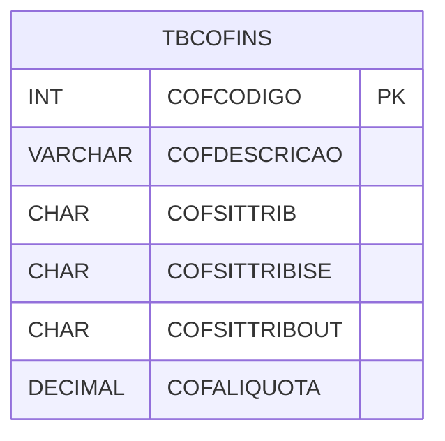

# TBCOFINS - Documentação Completa de Relacionamentos

## 📊 Informações Gerais

- **Nome da Tabela**: TBCOFINS (Tabela COFINS)
- **Total de Registros**: 4
- **Total de Colunas**: 21
- **Chave Primária**: COFCODIGO
- **Chaves Estrangeiras**: 0
- **Índices**: 0
- **Tabelas Dependentes**: 0
- **Banco de Dados**: Firebird

## 📝 Descrição

**TBCOFINS** é uma tabela mestre que armazena configurações de COFINS (Contribuição para o Financiamento da Seguridade Social). Com apenas **4 registros**, esta tabela define códigos de situação tributária para COFINS, incluindo situações para entrada, saída, ISE (Isento), OUT (Outras), SUF (Suframa), devoluções e outras configurações fiscais.

Esta tabela é essencial para:
- **COFINS**: Gerenciar configurações de COFINS
- **Fiscal**: Armazenar configurações fiscais
- **Rastreamento**: Rastrear códigos de situação tributária
- **Relatórios**: Gerar relatórios fiscais

---

## 🔑 Estrutura de Colunas (Principais)

| Coluna | Tipo | Descrição |
|--------|------|-----------|
| **COFCODIGO** 🔑 | INT | Código do COFINS (PK) |
| **COFDESCRICAO** | VARCHAR(37) | Descrição do código |
| **COFSITTRIB** | CHAR(1) | Situação tributária |
| **COFSITTRIBISE** | CHAR(1) | Situação tributária ISE |
| **COFSITTRIBOUT** | CHAR(1) | Situação tributária OUT |
| **COFALIQUOTA** | DECIMAL(18,2) | Alíquota do COFINS |
| **COFNATRECCST** | CHAR(1) | Natureza da receita CST |

---

## 🗺️ Diagrama de Relacionamentos



---

## 💡 Exemplos de Uso

### Consulta Básica

```sql
SELECT COFCODIGO, COFDESCRICAO, COFSITTRIB, COFSITTRIBISE, COFSITTRIBOUT, COFALIQUOTA
FROM TBCOFINS
WHERE COFCODIGO = ?;
```

---

## ⚡ Performance e Otimização

### Índices Recomendados

#### 1. Índice na Chave Primária (Já existe implicitamente)
```sql
-- Índice primário já existe implicitamente
```

---

## 📊 Estatísticas e Insights

- **Total de Registros**: 4
- **Códigos COFINS**: 4 códigos de situação tributária cadastrados

---

**Documentação gerada em**: 2025-01-27

**Banco de dados**: Firebird

