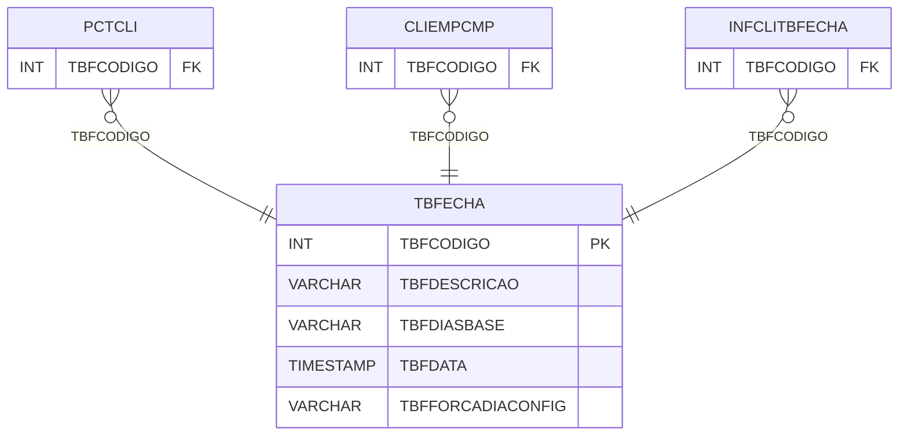

# TBFECHA - Documentação Completa de Relacionamentos

## 📊 Informações Gerais

- **Nome da Tabela**: TBFECHA (Tabela Fechamento)
- **Total de Registros**: 7
- **Total de Colunas**: 5
- **Chave Primária**: TBFCODIGO
- **Chaves Estrangeiras**: 0
- **Índices**: 0
- **Tabelas Dependentes**: 3
- **Banco de Dados**: Firebird

## 📝 Descrição

**TBFECHA** é uma tabela mestre que armazena informações sobre tabelas de fechamento. Com apenas **7 registros**, esta tabela define tipos de fechamento disponíveis no sistema, incluindo descrição, dias base, data e configuração de força diária.

Esta tabela é essencial para:
- **Fechamento**: Gerenciar tabelas de fechamento
- **Configuração**: Armazenar configurações de fechamento
- **Rastreamento**: Rastrear tabelas disponíveis
- **Relatórios**: Gerar relatórios de fechamento

---

## 🔑 Estrutura de Colunas

| Coluna | Tipo | Descrição |
|--------|------|-----------|
| **TBFCODIGO** 🔑 | INT | Código da tabela de fechamento (PK) |
| **TBFDESCRICAO** | VARCHAR(37) | Descrição da tabela |
| **TBFDIASBASE** | VARCHAR(37) | Dias base do fechamento |
| **TBFDATA** | TIMESTAMP | Data do fechamento |
| **TBFFORCADIACONFIG** | VARCHAR(37) | Configuração de força diária |

---

## 📊 Tabelas que Referenciam Esta

Esta tabela é referenciada por 3 tabelas:

### PCTCLI - Pedido Cliente
**Volume:** Variável

**Relacionamento:**
```
PCTCLI.TBFCODIGO → TBFECHA.TBFCODIGO (N:1)
Constraint: TBFECHA_PCTCLI
```

### CLIEMPCMP - Cliente Empresa Completo
**Volume:** Variável

**Relacionamento:**
```
CLIEMPCMP.TBFCODIGO → TBFECHA.TBFCODIGO (N:1)
Constraint: TBFECHA_CLIEMPCMP
```

### INFCLITBFECHA - Informação Cliente Tabela Fechamento
**Volume:** Variável

**Relacionamento:**
```
INFCLITBFECHA.TBFCODIGO → TBFECHA.TBFCODIGO (N:1)
Constraint: FK_INFCLITBFECHA_TBFECHA
```

---

## 🗺️ Diagrama de Relacionamentos



---

## 💡 Exemplos de Uso

### Consulta Básica

```sql
SELECT TBFCODIGO, TBFDESCRICAO, TBFDIASBASE, TBFDATA, TBFFORCADIACONFIG
FROM TBFECHA
WHERE TBFCODIGO = ?;
```

---

## ⚡ Performance e Otimização

### Índices Recomendados

#### 1. Índice na Chave Primária (Já existe implicitamente)
```sql
-- Índice primário já existe implicitamente
```

---

## 📊 Estatísticas e Insights

- **Total de Registros**: 7
- **Tabelas**: 7 tabelas de fechamento cadastradas

---

**Documentação gerada em**: 2025-01-27

**Banco de dados**: Firebird

