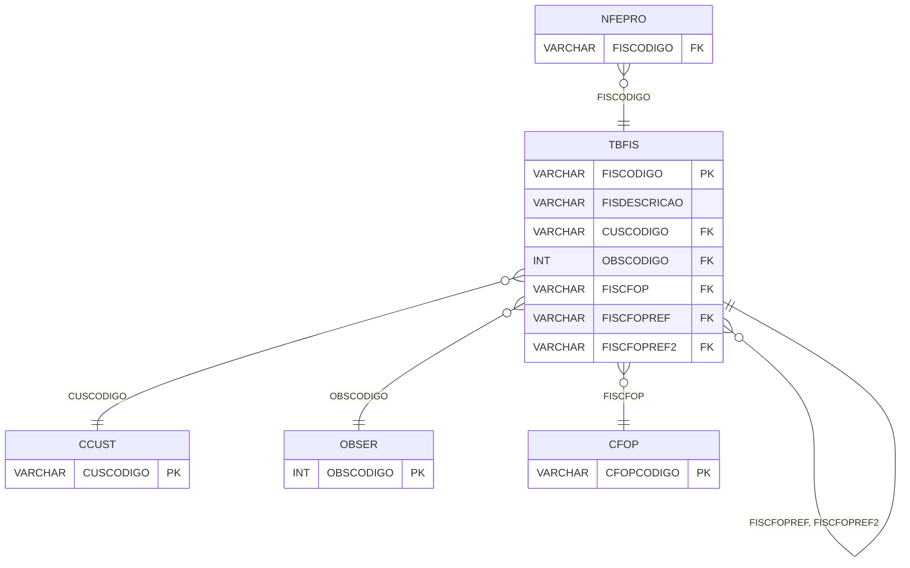

# TBFIS - Documentação Completa de Relacionamentos

## 📊 Informações Gerais

- **Nome da Tabela**: TBFIS (Tabela Fiscal)
- **Total de Registros**: 311
- **Total de Colunas**: 81
- **Chave Primária**: FISCODIGO
- **Chaves Estrangeiras**: 7
- **Índices**: 0
- **Tabelas Dependentes**: 30
- **Banco de Dados**: Firebird

## 📝 Descrição

**TBFIS** é uma tabela mestre extremamente importante que armazena configurações fiscais detalhadas. Com **311 registros**, esta tabela define códigos fiscais com todas as configurações necessárias para cálculo de impostos (ICMS, IPI, PIS, COFINS, CSLL), incluindo CFOPs, centro de custo, observações e muitas outras configurações fiscais.

Esta tabela é essencial para:
- **Configuração Fiscal**: Gerenciar todas as configurações fiscais
- **Cálculo de Impostos**: Fornecer dados para cálculos fiscais
- **Rastreamento**: Rastrear códigos fiscais disponíveis
- **Relatórios**: Gerar relatórios fiscais

**Contexto de Negócio:**
Esta é uma das tabelas mais importantes do sistema fiscal. Cada registro representa um código fiscal completo com todas as configurações necessárias para processamento de documentos fiscais, cálculos de impostos e geração de relatórios fiscais.

---

## 🔑 Estrutura de Colunas (Principais)

| Coluna | Tipo | Descrição |
|--------|------|-----------|
| **FISCODIGO** 🔑 | VARCHAR(14) | Código fiscal (PK) |
| **FISDESCRICAO** | VARCHAR(37) | Descrição do código fiscal |
| **CUSCODIGO** 🔗 | VARCHAR(14) | Código do centro de custo (FK → CCUST) |
| **OBSCODIGO** 🔗 | INT | Código da observação (FK → OBSER) |
| **FISICMS** | CHAR(1) | Código ICMS |
| **FISIPI** | CHAR(1) | Código IPI |
| **FISPIS** | CHAR(1) | Código PIS |
| **FISCOFINS** | CHAR(1) | Código COFINS |
| **FISCFOP** 🔗 | VARCHAR(37) | CFOP principal (FK → CFOP) |
| **FISCFOPREF** 🔗 | VARCHAR(37) | CFOP de referência (FK → TBFIS) |
| **FISCFOPREF2** 🔗 | VARCHAR(37) | CFOP de referência 2 (FK → TBFIS) |

---

## 🔗 Relacionamentos - Nível 1 (Diretos)

### CCUST - Centro de Custo (FK Opcional)
**Volume:** Variável

**Relacionamento:**
```
TBFIS.CUSCODIGO → CCUST.CUSCODIGO (N:1)
Constraint: CCUST_TBFIS
```

### OBSER - Observação (FK Opcional)
**Volume:** Variável

**Relacionamento:**
```
TBFIS.OBSCODIGO → OBSER.OBSCODIGO (N:1)
Constraint: OBSER_TBFIS
```

### CFOP - CFOP (FK Obrigatória)
**Volume:** Variável

**Relacionamento:**
```
TBFIS.FISCFOP → CFOP.CFOPCODIGO (N:1)
Constraint: CFOP_TBFIS
```

### TBFIS - Tabela Fiscal (Auto-referência)
**Volume:** 311 registros

**Relacionamento:**
```
TBFIS.FISCFOPREF → TBFIS.FISCODIGO (N:1)
TBFIS.FISCFOPREF2 → TBFIS.FISCODIGO (N:1)
TBFIS.FISREFDEVOLUCAO → TBFIS.FISCODIGO (N:1)
Constraint: TBFIS_TBFIS, TBFIS2_TBFIS, TBFISC_TBFIS
```

### TBPAUTAICMSUB - Tabela Pauta ICMS Substituição Tributária (FK Opcional)
**Volume:** Variável

**Relacionamento:**
```
TBFIS.TBPAUTAICMSUBCODIGO → TBPAUTAICMSUB.TBPAUTAICMSUBCODIGO (N:1)
Constraint: FK_TBIFS_TBPAUTAICMSUB
```

---

## 📊 Tabelas que Referenciam Esta

Esta tabela é referenciada por 30 tabelas, incluindo:

### NFEPRO - NFe Produto
**Volume:** Variável

**Relacionamento:**
```
NFEPRO.FISCODIGO → TBFIS.FISCODIGO (N:1)
Constraint: TBFIS_NFEPRO
```

### NFPRO - NF Produto
**Volume:** Variável

**Relacionamento:**
```
NFPRO.FISCODIGO → TBFIS.FISCODIGO (N:1)
Constraint: TBFIS_NFPRO
```

### PDSER - Pedido Serviço
**Volume:** Variável

**Relacionamento:**
```
PDSER.FISCODIGO → TBFIS.FISCODIGO (N:1)
Constraint: TBFIS_PDSER
```

---

## 🗺️ Diagrama de Relacionamentos



---

## 💡 Exemplos de Uso

### Consulta Básica

```sql
SELECT FISCODIGO, FISDESCRICAO, CUSCODIGO, OBSCODIGO, FISICMS, FISIPI, FISPIS, FISCOFINS, FISCFOP
FROM TBFIS
WHERE FISCODIGO = ?;
```

### Consulta com Informações do CFOP

```sql
SELECT 
    t.*,
    c.CFOPDESCRICAO
FROM TBFIS t
INNER JOIN CFOP c
    ON t.FISCFOP = c.CFOPCODIGO
WHERE t.FISCODIGO = ?;
```

---

## ⚡ Performance e Otimização

### Índices Recomendados

#### 1. Índice na Chave Primária (Já existe implicitamente)
```sql
-- Índice primário já existe implicitamente
```

#### 2. Índice em FISCFOP
```sql
CREATE INDEX IDX_TBFIS_CFOP 
ON TBFIS (FISCFOP);
```

**Justificativa:** Facilita buscas por CFOP.

---

## 📊 Estatísticas e Insights

- **Total de Registros**: 311
- **Códigos Fiscais**: 311 códigos fiscais cadastrados

---

**Documentação gerada em**: 2025-01-27

**Banco de dados**: Firebird

