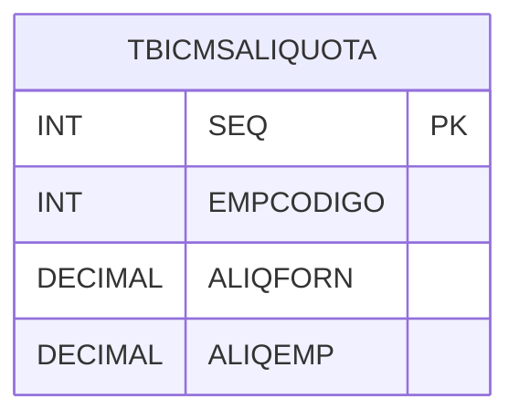

# TBICMSALIQUOTA - Documentação Completa de Relacionamentos

## 📊 Informações Gerais

- **Nome da Tabela**: TBICMSALIQUOTA (Tabela ICMS Alíquota)
- **Total de Registros**: 1
- **Total de Colunas**: 4
- **Chave Primária**: SEQ
- **Chaves Estrangeiras**: 0
- **Índices**: 0
- **Tabelas Dependentes**: 0
- **Banco de Dados**: Firebird

## 📝 Descrição

**TBICMSALIQUOTA** é uma tabela de configuração que armazena alíquotas padrão de ICMS para fornecedores e empresas. Com apenas **1 registro**, esta tabela define alíquotas padrão utilizadas no sistema.

Esta tabela é essencial para:
- **Alíquotas ICMS**: Gerenciar alíquotas padrão
- **Configuração**: Armazenar configurações de alíquotas
- **Rastreamento**: Rastrear alíquotas padrão

---

## 🔑 Estrutura de Colunas

| Coluna | Tipo | Descrição |
|--------|------|-----------|
| **SEQ** 🔑 | INT | Sequencial único (PK) |
| **EMPCODIGO** | INT | Código da empresa |
| **ALIQFORN** | DECIMAL(18,2) | Alíquota para fornecedores |
| **ALIQEMP** | DECIMAL(18,2) | Alíquota para empresa |

---

## 🗺️ Diagrama de Relacionamentos



---

## 💡 Exemplos de Uso

### Consulta Básica

```sql
SELECT SEQ, EMPCODIGO, ALIQFORN, ALIQEMP
FROM TBICMSALIQUOTA
WHERE EMPCODIGO = ?;
```

---

## ⚡ Performance e Otimização

### Índices Recomendados

#### 1. Índice na Chave Primária (Já existe implicitamente)
```sql
-- Índice primário já existe implicitamente
```

---

## 📊 Estatísticas e Insights

- **Total de Registros**: 1
- **Uso**: Tabela de configuração com volume mínimo

---

**Documentação gerada em**: 2025-01-27

**Banco de dados**: Firebird

