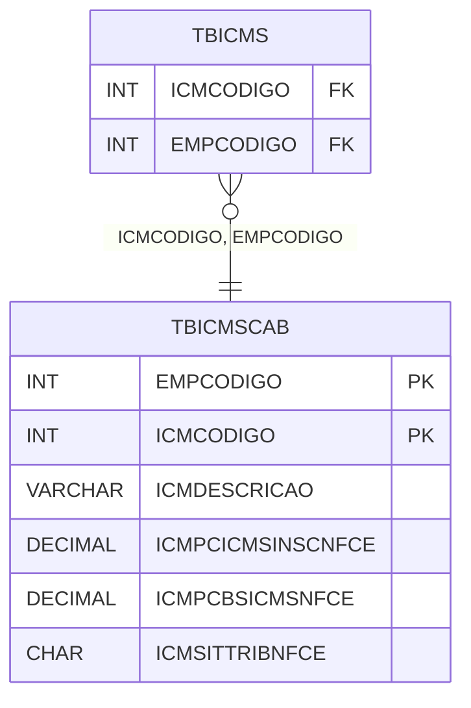

# TBICMSCAB - Documentação Completa de Relacionamentos

## 📊 Informações Gerais

- **Nome da Tabela**: TBICMSCAB (Tabela ICMS Cabeçalho)
- **Total de Registros**: 47
- **Total de Colunas**: 6
- **Chave Primária**: EMPCODIGO, ICMCODIGO (composite)
- **Chaves Estrangeiras**: 0
- **Índices**: 0
- **Tabelas Dependentes**: 2
- **Banco de Dados**: Firebird

## 📝 Descrição

**TBICMSCAB** é uma tabela mestre que armazena informações sobre códigos ICMS por empresa. Com **47 registros**, esta tabela define códigos ICMS disponíveis, incluindo descrição e configurações específicas para NFC-e (Nota Fiscal de Consumidor Eletrônica).

Esta tabela é essencial para:
- **ICMS**: Gerenciar códigos ICMS por empresa
- **Configuração**: Armazenar configurações de ICMS
- **Rastreamento**: Rastrear códigos disponíveis
- **Relatórios**: Gerar relatórios de ICMS

---

## 🔑 Estrutura de Colunas

| Coluna | Tipo | Descrição |
|--------|------|-----------|
| **EMPCODIGO** 🔑 | INT | Código da empresa (PK) |
| **ICMCODIGO** 🔑 | INT | Código do ICMS (PK) |
| **ICMDESCRICAO** | VARCHAR(37) | Descrição do código |
| **ICMPCICMSINSCNFCE** | DECIMAL(18,2) | Percentual ICMS inscrição NFC-e |
| **ICMPCBSICMSNFCE** | DECIMAL(18,2) | Percentual base cálculo ICMS NFC-e |
| **ICMSITTRIBNFCE** | CHAR(1) | Situação tributária NFC-e |

---

## 📊 Tabelas que Referenciam Esta

Esta tabela é referenciada por 2 tabelas:

### TBICMS - Tabela ICMS
**Volume:** 1.216 registros

**Relacionamento:**
```
TBICMS.ICMCODIGO → TBICMSCAB.ICMCODIGO (N:1)
TBICMS.EMPCODIGO → TBICMSCAB.EMPCODIGO (N:1)
Constraint: FK_TBICMS_1
```

### TBICMSALIQUOTA - Tabela ICMS Alíquota
**Volume:** 1 registro

**Relacionamento:**
```
TBICMSALIQUOTA.EMPCODIGO → TBICMSCAB.EMPCODIGO (N:1)
Constraint: (implícito)
```

---

## 🗺️ Diagrama de Relacionamentos



---

## 💡 Exemplos de Uso

### Consulta Básica

```sql
SELECT EMPCODIGO, ICMCODIGO, ICMDESCRICAO, ICMPCICMSINSCNFCE, ICMPCBSICMSNFCE, ICMSITTRIBNFCE
FROM TBICMSCAB
WHERE EMPCODIGO = ? AND ICMCODIGO = ?;
```

---

## ⚡ Performance e Otimização

### Índices Recomendados

#### 1. Índice Composto na Chave Primária (Já existe implicitamente)
```sql
-- Índice primário já existe implicitamente
```

---

## 📊 Estatísticas e Insights

- **Total de Registros**: 47
- **Códigos ICMS**: 47 códigos ICMS cadastrados por empresa

---

**Documentação gerada em**: 2025-01-27

**Banco de dados**: Firebird

