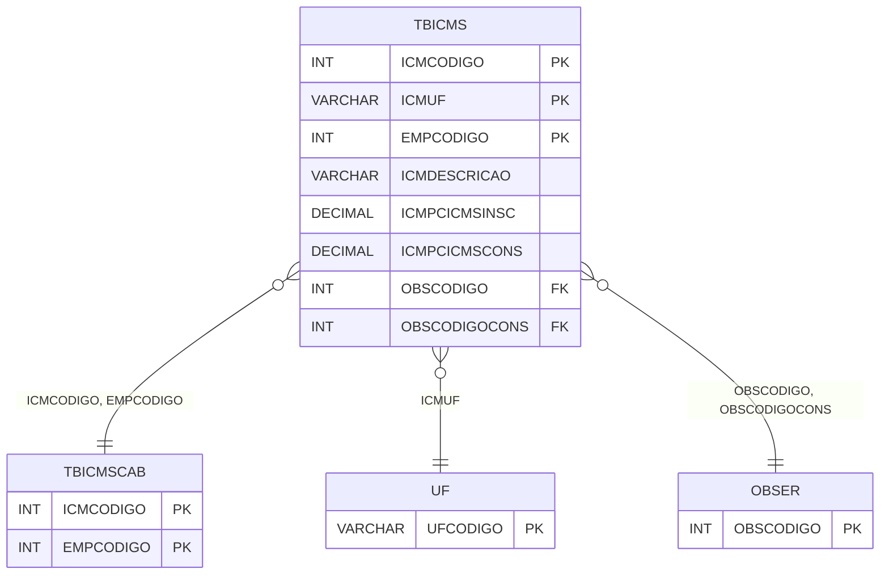

# TBICMS - Documentação Completa de Relacionamentos

## 📊 Informações Gerais

- **Nome da Tabela**: TBICMS (Tabela ICMS)
- **Total de Registros**: 1.216
- **Total de Colunas**: 32
- **Chave Primária**: ICMCODIGO, ICMUF, EMPCODIGO (composite)
- **Chaves Estrangeiras**: 5
- **Índices**: 0
- **Tabelas Dependentes**: 3
- **Banco de Dados**: Firebird

## 📝 Descrição

**TBICMS** é uma tabela intermediária que armazena configurações detalhadas de ICMS por estado e empresa. Com **1.216 registros**, esta tabela registra alíquotas, percentuais de base de cálculo, situações tributárias e outras configurações de ICMS específicas para cada combinação de código ICMS, UF e empresa.

Esta tabela é essencial para:
- **ICMS**: Gerenciar configurações de ICMS por estado
- **Fiscal**: Armazenar configurações fiscais por UF
- **Rastreamento**: Rastrear configurações por estado
- **Relatórios**: Gerar relatórios fiscais

---

## 🔑 Estrutura de Colunas (Principais)

| Coluna | Tipo | Descrição |
|--------|------|-----------|
| **ICMCODIGO** 🔑 🔗 | INT | Código do ICMS (PK, FK → TBICMSCAB) |
| **ICMUF** 🔑 🔗 | VARCHAR(14) | UF (PK, FK → UF) |
| **ICMDESCRICAO** | VARCHAR(37) | Descrição |
| **ICMPCICMSINSC** | DECIMAL(18,2) | Percentual ICMS inscrição |
| **ICMPCICMSCONS** | DECIMAL(18,2) | Percentual ICMS consumo |
| **ICMPCBSICMS** | DECIMAL(18,2) | Percentual base cálculo ICMS |
| **ICMPCBSICMSSUB** | DECIMAL(18,2) | Percentual base cálculo ICMS ST |
| **ICMPCICMSSUB** | DECIMAL(18,2) | Percentual ICMS ST |
| **EMPCODIGO** 🔑 🔗 | INT | Código da empresa (PK, FK → TBICMSCAB) |
| **OBSCODIGO** 🔗 | INT | Código da observação (FK → OBSER) |
| **OBSCODIGOCONS** 🔗 | INT | Código da observação consumo (FK → OBSER) |

---

## 🔗 Relacionamentos - Nível 1 (Diretos)

### TBICMSCAB - Tabela ICMS Cabeçalho (FK Obrigatória)
**Volume:** 47 registros

**Relacionamento:**
```
TBICMS.ICMCODIGO → TBICMSCAB.ICMCODIGO (N:1)
TBICMS.EMPCODIGO → TBICMSCAB.EMPCODIGO (N:1)
Constraint: FK_TBICMS_1
```

### UF - Unidade Federativa (FK Obrigatória)
**Volume:** 27 registros

**Relacionamento:**
```
TBICMS.ICMUF → UF.UFCODIGO (N:1)
Constraint: UF_TBICMS
```

### OBSER - Observação (FK Opcional)
**Volume:** Variável

**Relacionamento:**
```
TBICMS.OBSCODIGO → OBSER.OBSCODIGO (N:1)
TBICMS.OBSCODIGOCONS → OBSER.OBSCODIGO (N:1)
Constraint: OBSER_TBICMS, OBSERCONS_TBICMS
```

---

## 📊 Tabelas que Referenciam Esta

Esta tabela é referenciada por 3 tabelas:

### DCTIPERC - Documento Tipo Percentual
**Volume:** Variável

**Relacionamento:**
```
DCTIPERC.ICMCODIGO → TBICMS.ICMCODIGO (N:1)
DCTIPERC.ICMUF → TBICMS.ICMUF (N:1)
DCTIPERC.EMPCODIGO → TBICMS.EMPCODIGO (N:1)
Constraint: TBICMS_DCTIPERC
```

---

## 🗺️ Diagrama de Relacionamentos



---

## 💡 Exemplos de Uso

### Consulta Básica

```sql
SELECT ICMCODIGO, ICMUF, EMPCODIGO, ICMDESCRICAO, ICMPCICMSINSC, ICMPCICMSCONS
FROM TBICMS
WHERE ICMCODIGO = ? AND ICMUF = ? AND EMPCODIGO = ?;
```

---

## ⚡ Performance e Otimização

### Índices Recomendados

#### 1. Índice Composto na Chave Primária (Já existe implicitamente)
```sql
-- Índice primário já existe implicitamente
```

---

## 📊 Estatísticas e Insights

- **Total de Registros**: 1.216
- **Média por Código ICMS**: ~25,9 UFs por código ICMS (1.216 / 47)

---

**Documentação gerada em**: 2025-01-27

**Banco de dados**: Firebird

