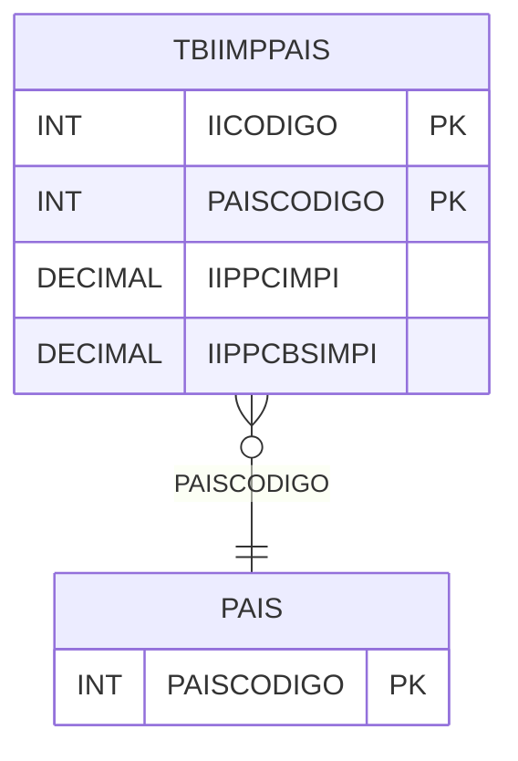

# TBIIMPPAIS - Documentação Completa de Relacionamentos

## 📊 Informações Gerais

- **Nome da Tabela**: TBIIMPPAIS (Tabela II Importação País)
- **Total de Registros**: 31
- **Total de Colunas**: 4
- **Chave Primária**: IICODIGO, PAISCODIGO (composite)
- **Chaves Estrangeiras**: 1
- **Índices**: 0
- **Tabelas Dependentes**: 0
- **Banco de Dados**: Firebird

## 📝 Descrição

**TBIIMPPAIS** é uma tabela intermediária que associa códigos de imposto de importação (II) a países. Com **31 registros**, esta tabela define percentuais de imposto de importação por país, incluindo percentuais de importação e base de cálculo.

Esta tabela é essencial para:
- **Fiscal**: Gerenciar impostos de importação por país
- **Tributação**: Calcular II baseado em país de origem
- **Rastreamento**: Rastrear regras de II por país
- **Relatórios**: Gerar relatórios fiscais de importação

---

## 🔑 Estrutura de Colunas

| Coluna | Tipo | Descrição |
|--------|------|-----------|
| **IICODIGO** 🔑 | INT | Código do imposto de importação (PK) |
| **PAISCODIGO** 🔑 🔗 | INT | Código do país (PK, FK → PAIS) |
| **IIPPCIMPI** | DECIMAL(18,2) | Percentual de importação |
| **IIPPCBSIMPI** | DECIMAL(18,2) | Percentual base de cálculo de importação |

---

## 🔗 Relacionamentos - Nível 1 (Diretos)

### PAIS - País (FK Obrigatória)
**Volume:** Variável

**Relacionamento:**
```
TBIIMPPAIS.PAISCODIGO → PAIS.PAISCODIGO (N:1)
Constraint: PAIS_TBIIMPPAIS
```

---

## 🗺️ Diagrama de Relacionamentos



---

## 💡 Exemplos de Uso

### Consulta Básica

```sql
SELECT IICODIGO, PAISCODIGO, IIPPCIMPI, IIPPCBSIMPI
FROM TBIIMPPAIS
WHERE IICODIGO = ? AND PAISCODIGO = ?;
```

---

## ⚡ Performance e Otimização

### Índices Recomendados

#### 1. Índice Composto na Chave Primária (Já existe implicitamente)
```sql
-- Índice primário já existe implicitamente
```

---

## 📊 Estatísticas e Insights

- **Total de Registros**: 31
- **Regras II**: 31 regras de imposto de importação por país

---

**Documentação gerada em**: 2025-01-27

**Banco de dados**: Firebird

