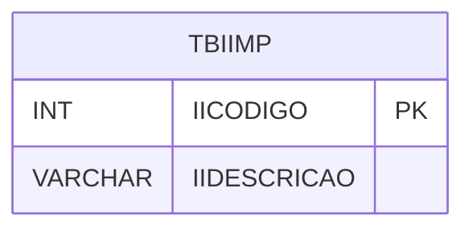

# TBIIMP - Documentação Completa de Relacionamentos

## 📊 Informações Gerais

- **Nome da Tabela**: TBIIMP (Tabela II Imposto de Importação)
- **Total de Registros**: 14
- **Total de Colunas**: 2
- **Chave Primária**: IICODIGO
- **Chaves Estrangeiras**: 0
- **Índices**: 0
- **Tabelas Dependentes**: 0
- **Banco de Dados**: Firebird

## 📝 Descrição

**TBIIMP** é uma tabela mestre que armazena informações sobre códigos de Imposto de Importação (II). Com **14 registros**, esta tabela define códigos de II disponíveis no sistema, incluindo descrição.

Esta tabela é essencial para:
- **II**: Gerenciar códigos de Imposto de Importação
- **Configuração**: Armazenar configurações de II
- **Rastreamento**: Rastrear códigos disponíveis
- **Relatórios**: Gerar relatórios fiscais

---

## 🔑 Estrutura de Colunas

| Coluna | Tipo | Descrição |
|--------|------|-----------|
| **IICODIGO** 🔑 | INT | Código do II (PK) |
| **IIDESCRICAO** | VARCHAR(37) | Descrição do código |

---

## 🗺️ Diagrama de Relacionamentos



---

## 💡 Exemplos de Uso

### Consulta Básica

```sql
SELECT IICODIGO, IIDESCRICAO
FROM TBIIMP
WHERE IICODIGO = ?;
```

---

## ⚡ Performance e Otimização

### Índices Recomendados

#### 1. Índice na Chave Primária (Já existe implicitamente)
```sql
-- Índice primário já existe implicitamente
```

---

## 📊 Estatísticas e Insights

- **Total de Registros**: 14
- **Códigos II**: 14 códigos de Imposto de Importação cadastrados

---

**Documentação gerada em**: 2025-01-27

**Banco de dados**: Firebird

