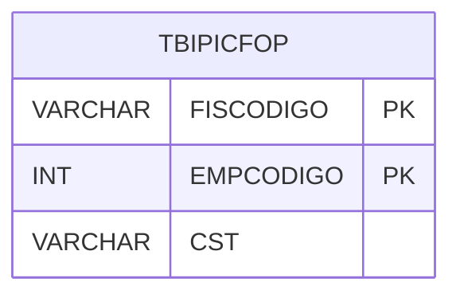

# TBIPICFOP - Documentação Completa de Relacionamentos

## 📊 Informações Gerais

- **Nome da Tabela**: TBIPICFOP (Tabela IPI CFOP)
- **Total de Registros**: 335
- **Total de Colunas**: 3
- **Chave Primária**: FISCODIGO, EMPCODIGO (composite)
- **Chaves Estrangeiras**: 0
- **Índices**: 0
- **Tabelas Dependentes**: 0
- **Banco de Dados**: Firebird

## 📝 Descrição

**TBIPICFOP** é uma tabela intermediária que associa códigos fiscais (TBFIS) a códigos CST de IPI por empresa. Com **335 registros**, esta tabela define regras de tributação IPI específicas por CFOP e empresa.

Esta tabela é essencial para:
- **Fiscal**: Gerenciar regras de IPI por CFOP
- **Tributação**: Calcular IPI baseado em CFOP e empresa
- **Rastreamento**: Rastrear regras de IPI por CFOP
- **Relatórios**: Gerar relatórios fiscais de IPI por CFOP

---

## 🔑 Estrutura de Colunas

| Coluna | Tipo | Descrição |
|--------|------|-----------|
| **FISCODIGO** 🔑 | VARCHAR(14) | Código fiscal (PK) |
| **EMPCODIGO** 🔑 | INT | Código da empresa (PK) |
| **CST** | VARCHAR(14) | Código de situação tributária IPI |

---

## 🗺️ Diagrama de Relacionamentos



---

## 💡 Exemplos de Uso

### Consulta Básica

```sql
SELECT FISCODIGO, EMPCODIGO, CST
FROM TBIPICFOP
WHERE FISCODIGO = ? AND EMPCODIGO = ?;
```

---

## ⚡ Performance e Otimização

### Índices Recomendados

#### 1. Índice Composto na Chave Primária (Já existe implicitamente)
```sql
-- Índice primário já existe implicitamente
```

---

## 📊 Estatísticas e Insights

- **Total de Registros**: 335
- **Regras IPI**: 335 regras de IPI por CFOP e empresa

---

**Documentação gerada em**: 2025-01-27

**Banco de dados**: Firebird

