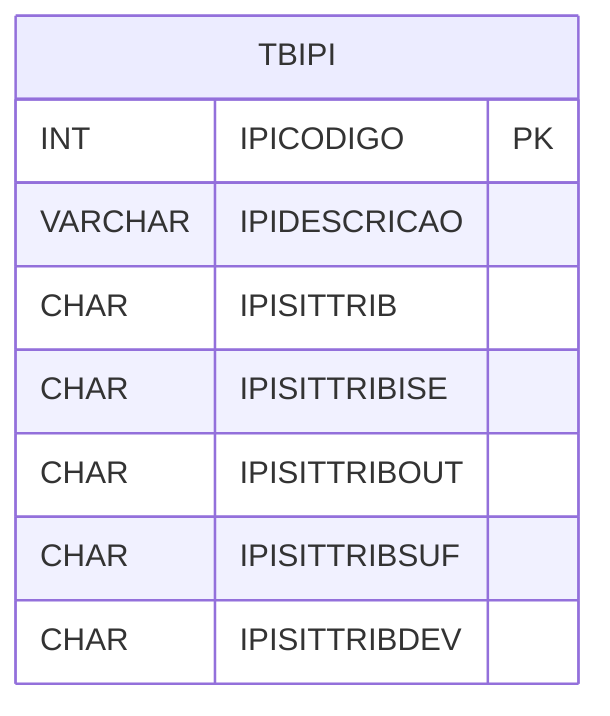

# TBIPI - Documentação Completa de Relacionamentos

## 📊 Informações Gerais

- **Nome da Tabela**: TBIPI (Tabela IPI)
- **Total de Registros**: 3
- **Total de Colunas**: 19
- **Chave Primária**: IPICODIGO
- **Chaves Estrangeiras**: 0
- **Índices**: 0
- **Tabelas Dependentes**: 0
- **Banco de Dados**: Firebird

## 📝 Descrição

**TBIPI** é uma tabela mestre que armazena configurações de IPI (Imposto sobre Produtos Industrializados). Com apenas **3 registros**, esta tabela define regras de tributação IPI para diferentes situações: entrada, saída, SUFRAMA, devolução, e suas combinações.

Esta tabela é essencial para:
- **Fiscal**: Gerenciar configurações de IPI
- **Tributação**: Calcular IPI em diferentes cenários
- **Rastreamento**: Rastrear regras de IPI por situação
- **Relatórios**: Gerar relatórios fiscais de IPI

---

## 🔑 Estrutura de Colunas (Principais)

| Coluna | Tipo | Descrição |
|--------|------|-----------|
| **IPICODIGO** 🔑 | INT | Código da configuração IPI (PK) |
| **IPIDESCRICAO** | VARCHAR(37) | Descrição da configuração |
| **IPISITTRIB** | CHAR(1) | Situação tributária padrão |
| **IPISITTRIBISE** | CHAR(1) | Situação tributária ISENTO |
| **IPISITTRIBOUT** | CHAR(1) | Situação tributária OUTROS |
| **IPISITTRIBSUF** | CHAR(1) | Situação tributária SUFRAMA |
| **IPISITTRIBDEV** | CHAR(1) | Situação tributária DEVOLUÇÃO |
| **IPISITTRIBISEDEV** | CHAR(1) | Situação tributária ISENTO DEVOLUÇÃO |
| **IPISITTRIBOUTDEV** | CHAR(1) | Situação tributária OUTROS DEVOLUÇÃO |
| **IPISITTRIBSUFDEV** | CHAR(1) | Situação tributária SUFRAMA DEVOLUÇÃO |
| **IPICODENQ** | VARCHAR(14) | Código de enquadramento padrão |
| **IPICODENQISE** | VARCHAR(14) | Código de enquadramento ISENTO |
| **IPICODENQOUT** | VARCHAR(14) | Código de enquadramento OUTROS |
| **IPICODENQSUF** | VARCHAR(14) | Código de enquadramento SUFRAMA |
| **IPICODENQDEV** | VARCHAR(14) | Código de enquadramento DEVOLUÇÃO |
| **IPICODENQISEDEV** | VARCHAR(14) | Código de enquadramento ISENTO DEVOLUÇÃO |
| **IPICODENQOUTDEV** | VARCHAR(14) | Código de enquadramento OUTROS DEVOLUÇÃO |
| **IPICODENQSUFDEV** | VARCHAR(14) | Código de enquadramento SUFRAMA DEVOLUÇÃO |
| **IPIENTSAI** | VARCHAR(37) | Entrada/Saída |

---

## 🗺️ Diagrama de Relacionamentos



---

## 💡 Exemplos de Uso

### Consulta Básica

```sql
SELECT IPICODIGO, IPIDESCRICAO, IPISITTRIB, IPISITTRIBISE, IPISITTRIBOUT
FROM TBIPI
WHERE IPICODIGO = ?;
```

---

## ⚡ Performance e Otimização

### Índices Recomendados

#### 1. Índice na Chave Primária (Já existe implicitamente)
```sql
-- Índice primário já existe implicitamente
```

---

## 📊 Estatísticas e Insights

- **Total de Registros**: 3
- **Configurações IPI**: 3 configurações de IPI cadastradas

---

**Documentação gerada em**: 2025-01-27

**Banco de dados**: Firebird

