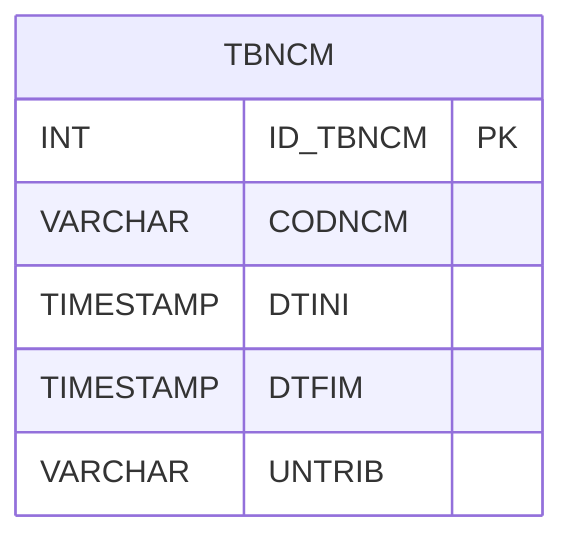

# TBNCM - Documentação Completa de Relacionamentos

## 📊 Informações Gerais

- **Nome da Tabela**: TBNCM (Tabela NCM)
- **Total de Registros**: 10.249
- **Total de Colunas**: 5
- **Chave Primária**: ID_TBNCM
- **Chaves Estrangeiras**: 0
- **Índices**: 1
- **Tabelas Dependentes**: 0
- **Banco de Dados**: Firebird

## 📝 Descrição

**TBNCM** é uma tabela mestre que armazena informações sobre códigos NCM (Nomenclatura Comum do Mercosul). Com **10.249 registros**, esta tabela define códigos NCM disponíveis no sistema, incluindo código, datas de início e fim de vigência, e unidade tributável.

Esta tabela é essencial para:
- **Fiscal**: Gerenciar códigos NCM para fins fiscais
- **Classificação**: Classificar produtos por código NCM
- **Rastreamento**: Rastrear códigos NCM por período de vigência
- **Relatórios**: Gerar relatórios fiscais por código NCM

---

## 🔑 Estrutura de Colunas

| Coluna | Tipo | Descrição |
|--------|------|-----------|
| **ID_TBNCM** 🔑 | INT | ID único (PK) |
| **CODNCM** | VARCHAR(37) | Código NCM |
| **DTINI** | TIMESTAMP | Data de início de vigência |
| **DTFIM** | TIMESTAMP | Data de fim de vigência |
| **UNTRIB** | VARCHAR(37) | Unidade tributável |

---

## 📇 Índices

| Nome do Índice | Colunas | Único |
|----------------|---------|-------|
| IND_DATA_TBNCM | DTINI | Não |

---

## 🗺️ Diagrama de Relacionamentos



---

## 💡 Exemplos de Uso

### Consulta Básica

```sql
SELECT ID_TBNCM, CODNCM, DTINI, DTFIM, UNTRIB
FROM TBNCM
WHERE ID_TBNCM = ?;
```

### Consulta por Código NCM

```sql
SELECT ID_TBNCM, CODNCM, DTINI, DTFIM, UNTRIB
FROM TBNCM
WHERE CODNCM = ?
ORDER BY DTINI DESC;
```

### Consulta por Período de Vigência

```sql
SELECT ID_TBNCM, CODNCM, DTINI, DTFIM, UNTRIB
FROM TBNCM
WHERE DTINI <= ? AND (DTFIM IS NULL OR DTFIM >= ?)
ORDER BY CODNCM, DTINI;
```

---

## ⚡ Performance e Otimização

### Índices Recomendados

#### 1. Índice na Chave Primária (Já existe implicitamente)
```sql
-- Índice primário já existe implicitamente
```

#### 2. Índice Existente
O índice em DTINI já está criado e é adequado para consultas por período.

#### 3. Índice em CODNCM
```sql
CREATE INDEX IDX_TBNCM_CODNCM 
ON TBNCM (CODNCM);
```

**Justificativa:** Facilita buscas por código NCM.

---

## 📊 Estatísticas e Insights

- **Total de Registros**: 10.249
- **Códigos NCM**: 10.249 códigos NCM cadastrados

---

**Documentação gerada em**: 2025-01-27

**Banco de dados**: Firebird

