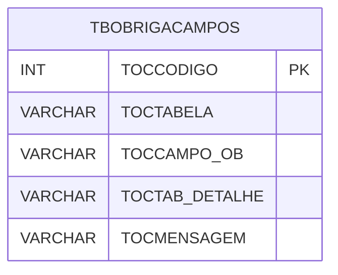

# TBOBRIGACAMPOS - Documentação Completa de Relacionamentos

## 📊 Informações Gerais

- **Nome da Tabela**: TBOBRIGACAMPOS (Tabela Obriga Campos)
- **Total de Registros**: 9
- **Total de Colunas**: 5
- **Chave Primária**: TOCCODIGO
- **Chaves Estrangeiras**: 0
- **Índices**: 0
- **Tabelas Dependentes**: 0
- **Banco de Dados**: Firebird

## 📝 Descrição

**TBOBRIGACAMPOS** é uma tabela de configuração que armazena informações sobre campos obrigatórios em tabelas específicas. Com apenas **9 registros**, esta tabela define quais campos são obrigatórios em quais tabelas, incluindo mensagens de validação e tabelas de detalhe relacionadas.

Esta tabela é essencial para:
- **Validação**: Gerenciar validações de campos obrigatórios
- **Configuração**: Armazenar configurações de validação
- **Rastreamento**: Rastrear campos obrigatórios
- **Relatórios**: Gerar relatórios de validação

---

## 🔑 Estrutura de Colunas

| Coluna | Tipo | Descrição |
|--------|------|-----------|
| **TOCCODIGO** 🔑 | INT | Código da obrigação (PK) |
| **TOCTABELA** | VARCHAR(37) | Nome da tabela |
| **TOCCAMPO_OB** | VARCHAR(37) | Campo obrigatório |
| **TOCTAB_DETALHE** | VARCHAR(37) | Tabela de detalhe |
| **TOCMENSAGEM** | VARCHAR(37) | Mensagem de validação |

---

## 🗺️ Diagrama de Relacionamentos



---

## 💡 Exemplos de Uso

### Consulta Básica

```sql
SELECT TOCCODIGO, TOCTABELA, TOCCAMPO_OB, TOCTAB_DETALHE, TOCMENSAGEM
FROM TBOBRIGACAMPOS
WHERE TOCTABELA = ?;
```

---

## ⚡ Performance e Otimização

### Índices Recomendados

#### 1. Índice na Chave Primária (Já existe implicitamente)
```sql
-- Índice primário já existe implicitamente
```

#### 2. Índice em TOCTABELA
```sql
CREATE INDEX IDX_TBOBRIGACAMPOS_TABELA 
ON TBOBRIGACAMPOS (TOCTABELA);
```

**Justificativa:** Facilita buscas por tabela.

---

## 📊 Estatísticas e Insights

- **Total de Registros**: 9
- **Validações**: 9 configurações de campos obrigatórios

---

**Documentação gerada em**: 2025-01-27

**Banco de dados**: Firebird

