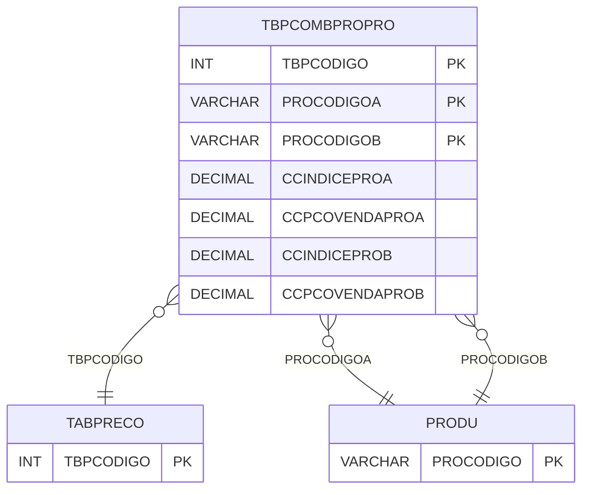

# TBPCOMBPROPRO - Documentação Completa de Relacionamentos

## 📊 Informações Gerais

- **Nome da Tabela**: TBPCOMBPROPRO (Tabela Preço Combinação Produto Produto)
- **Total de Registros**: 1.830
- **Total de Colunas**: 11
- **Chave Primária**: TBPCODIGO, PROCODIGOA, PROCODIGOB (composite)
- **Chaves Estrangeiras**: 3
- **Índices**: 0
- **Tabelas Dependentes**: 0
- **Banco de Dados**: Firebird

## 📝 Descrição

**TBPCOMBPROPRO** é uma tabela intermediária que armazena preços para combinações de produtos em tabelas de preço. Com **1.830 registros**, esta tabela registra preços e índices para pares de produtos (Produto A e Produto B), permitindo definir preços especiais quando produtos são vendidos em combinação.

Esta tabela é essencial para:
- **Preços Combinados**: Gerenciar preços para combinações de produtos
- **Descontos**: Armazenar descontos por combinação
- **Rastreamento**: Rastrear preços por combinação
- **Relatórios**: Gerar relatórios de preços combinados

---

## 🔑 Estrutura de Colunas

| Coluna | Tipo | Descrição |
|--------|------|-----------|
| **TBPCODIGO** 🔑 🔗 | INT | Código da tabela de preço (PK, FK → TABPRECO) |
| **PROCODIGOA** 🔑 🔗 | VARCHAR(14) | Código do produto A (PK, FK → PRODU) |
| **CCINDICEPROA** | DECIMAL(18,2) | Índice do produto A |
| **CCINDICEPROA2** | DECIMAL(18,2) | Índice do produto A 2 |
| **CCPCOVENDAPROA** | DECIMAL(18,2) | Percentual de venda produto A |
| **CCPCOVENDAPROA2** | DECIMAL(18,2) | Percentual de venda produto A 2 |
| **PROCODIGOB** 🔑 🔗 | VARCHAR(14) | Código do produto B (PK, FK → PRODU) |
| **CCINDICEPROB** | DECIMAL(18,2) | Índice do produto B |
| **CCINDICEPROB2** | DECIMAL(18,2) | Índice do produto B 2 |
| **CCPCOVENDAPROB** | DECIMAL(18,2) | Percentual de venda produto B |
| **CCPCOVENDAPROB2** | DECIMAL(18,2) | Percentual de venda produto B 2 |

---

## 🔗 Relacionamentos - Nível 1 (Diretos)

### TABPRECO - Tabela Preço (FK Obrigatória)
**Volume:** 112 registros

**Relacionamento:**
```
TBPCOMBPROPRO.TBPCODIGO → TABPRECO.TBPCODIGO (N:1)
Constraint: TABPRECO_TBPCOMBPROPRO
```

### PRODU - Produto A (FK Obrigatória)
**Volume:** Variável

**Relacionamento:**
```
TBPCOMBPROPRO.PROCODIGOA → PRODU.PROCODIGO (N:1)
Constraint: PRODU_TBPCOMBPROPRO
```

### PRODU - Produto B (FK Obrigatória)
**Volume:** Variável

**Relacionamento:**
```
TBPCOMBPROPRO.PROCODIGOB → PRODU.PROCODIGO (N:1)
Constraint: PRODU_TBPCOMBPROPROB
```

---

## 🗺️ Diagrama de Relacionamentos



---

## 💡 Exemplos de Uso

### Consulta Básica

```sql
SELECT TBPCODIGO, PROCODIGOA, PROCODIGOB, CCINDICEPROA, CCPCOVENDAPROA, CCINDICEPROB, CCPCOVENDAPROB
FROM TBPCOMBPROPRO
WHERE TBPCODIGO = ? AND PROCODIGOA = ?;
```

---

## ⚡ Performance e Otimização

### Índices Recomendados

#### 1. Índice Composto na Chave Primária (Já existe implicitamente)
```sql
-- Índice primário já existe implicitamente
```

---

## 📊 Estatísticas e Insights

- **Total de Registros**: 1.830
- **Combinações**: 1.830 combinações de produtos cadastradas

---

**Documentação gerada em**: 2025-01-27

**Banco de dados**: Firebird

