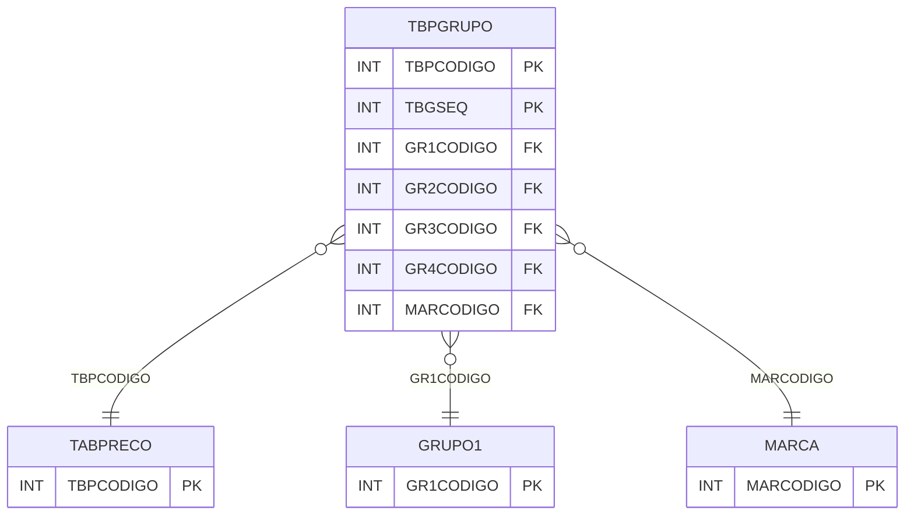

# TBPGRUPO - Documentação Completa de Relacionamentos

## 📊 Informações Gerais

- **Nome da Tabela**: TBPGRUPO (Tabela Preço Grupo)
- **Total de Registros**: 1.328
- **Total de Colunas**: 11
- **Chave Primária**: TBPCODIGO, TBGSEQ (composite)
- **Chaves Estrangeiras**: 6
- **Índices**: 0
- **Tabelas Dependentes**: 0
- **Banco de Dados**: Firebird

## 📝 Descrição

**TBPGRUPO** é uma tabela intermediária que armazena preços por grupos de produtos e marcas em tabelas de preço. Com **1.328 registros**, esta tabela registra percentuais de desconto e valores para combinações de grupos (GRUPO1, GRUPO2, GRUPO3, GRUPO4) e marcas.

Esta tabela é essencial para:
- **Preços por Grupo**: Gerenciar preços por grupos de produtos
- **Descontos**: Armazenar descontos por grupo
- **Marcas**: Associar preços a marcas específicas
- **Relatórios**: Gerar relatórios de preços por grupo

---

## 🔑 Estrutura de Colunas

| Coluna | Tipo | Descrição |
|--------|------|-----------|
| **TBPCODIGO** 🔑 🔗 | INT | Código da tabela de preço (PK, FK → TABPRECO) |
| **GR1CODIGO** 🔗 | INT | Código do grupo 1 (FK → GRUPO1) |
| **GR2CODIGO** 🔗 | INT | Código do grupo 2 (FK → GRUPO2) |
| **GR3CODIGO** 🔗 | INT | Código do grupo 3 (FK → GRUPO3) |
| **GR4CODIGO** 🔗 | INT | Código do grupo 4 (FK → GRUPO4) |
| **TBGSEQ** 🔑 | INT | Sequência do grupo (PK) |
| **TBGPCDESCTO** | DECIMAL(18,2) | Percentual de desconto |
| **TBGPCDESCTO2** | DECIMAL(18,2) | Percentual de desconto 2 |
| **MARCODIGO** 🔗 | INT | Código da marca (FK → MARCA) |
| **TBPNGRUPO** | INT | Número do grupo |
| **TBPNVALOR** | VARCHAR(37) | Valor do grupo |

---

## 🔗 Relacionamentos - Nível 1 (Diretos)

### TABPRECO - Tabela Preço (FK Obrigatória)
**Volume:** 112 registros

**Relacionamento:**
```
TBPGRUPO.TBPCODIGO → TABPRECO.TBPCODIGO (N:1)
Constraint: TABPRECO_TBPGRUPO
```

### GRUPO1 - Grupo 1 (FK Opcional)
**Volume:** Variável

**Relacionamento:**
```
TBPGRUPO.GR1CODIGO → GRUPO1.GR1CODIGO (N:1)
Constraint: GRUPO1_TBPGRUPO
```

### GRUPO2 - Grupo 2 (FK Opcional)
**Volume:** Variável

**Relacionamento:**
```
TBPGRUPO.GR2CODIGO → GRUPO2.GR2CODIGO (N:1)
Constraint: GRUPO2_TBPGRUPO
```

### GRUPO3 - Grupo 3 (FK Opcional)
**Volume:** Variável

**Relacionamento:**
```
TBPGRUPO.GR3CODIGO → GRUPO3.GR3CODIGO (N:1)
Constraint: GRUPO3_TBPGRUPO
```

### GRUPO4 - Grupo 4 (FK Opcional)
**Volume:** Variável

**Relacionamento:**
```
TBPGRUPO.GR4CODIGO → GRUPO4.GR4CODIGO (N:1)
Constraint: GRUPO4_TBPGRUPO
```

### MARCA - Marca (FK Opcional)
**Volume:** Variável

**Relacionamento:**
```
TBPGRUPO.MARCODIGO → MARCA.MARCODIGO (N:1)
Constraint: MARCODIGO_TBPGRUPO
```

---

## 🗺️ Diagrama de Relacionamentos



---

## 💡 Exemplos de Uso

### Consulta Básica

```sql
SELECT TBPCODIGO, TBGSEQ, GR1CODIGO, GR2CODIGO, GR3CODIGO, GR4CODIGO, MARCODIGO, TBGPCDESCTO
FROM TBPGRUPO
WHERE TBPCODIGO = ?
ORDER BY TBGSEQ;
```

---

## ⚡ Performance e Otimização

### Índices Recomendados

#### 1. Índice Composto na Chave Primária (Já existe implicitamente)
```sql
-- Índice primário já existe implicitamente
```

---

## 📊 Estatísticas e Insights

- **Total de Registros**: 1.328
- **Média por Tabela**: ~11,9 grupos por tabela (1.328 / 112)

---

**Documentação gerada em**: 2025-01-27

**Banco de dados**: Firebird

