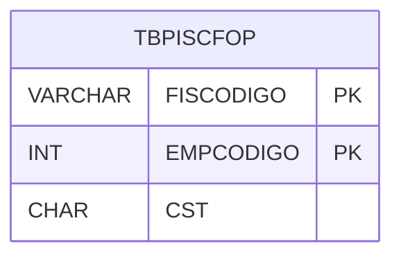

# TBPISCFOP - Documentação Completa de Relacionamentos

## 📊 Informações Gerais

- **Nome da Tabela**: TBPISCFOP (Tabela PIS CFOP)
- **Total de Registros**: 335
- **Total de Colunas**: 3
- **Chave Primária**: FISCODIGO, EMPCODIGO (composite)
- **Chaves Estrangeiras**: 0
- **Índices**: 0
- **Tabelas Dependentes**: 0
- **Banco de Dados**: Firebird

## 📝 Descrição

**TBPISCFOP** é uma tabela de relacionamento que associa códigos fiscais (TBFIS) com códigos de situação tributária (CST) de PIS por empresa. Com **335 registros**, esta tabela registra quais CSTs de PIS devem ser utilizados para cada combinação de código fiscal e empresa.

Esta tabela é essencial para:
- **PIS**: Gerenciar CSTs de PIS por código fiscal
- **Fiscal**: Armazenar mapeamentos fiscais
- **Rastreamento**: Rastrear CSTs por código fiscal
- **Relatórios**: Gerar relatórios fiscais

---

## 🔑 Estrutura de Colunas

| Coluna | Tipo | Descrição |
|--------|------|-----------|
| **FISCODIGO** 🔑 | VARCHAR(14) | Código fiscal (PK) |
| **EMPCODIGO** 🔑 | INT | Código da empresa (PK) |
| **CST** | CHAR(1) | Código de situação tributária PIS |

---

## 🗺️ Diagrama de Relacionamentos



---

## 💡 Exemplos de Uso

### Consulta Básica

```sql
SELECT FISCODIGO, EMPCODIGO, CST
FROM TBPISCFOP
WHERE FISCODIGO = ? AND EMPCODIGO = ?;
```

---

## ⚡ Performance e Otimização

### Índices Recomendados

#### 1. Índice Composto na Chave Primária (Já existe implicitamente)
```sql
-- Índice primário já existe implicitamente
```

---

## 📊 Estatísticas e Insights

- **Total de Registros**: 335
- **Mapeamentos**: 335 mapeamentos de CST PIS por código fiscal

---

**Documentação gerada em**: 2025-01-27

**Banco de dados**: Firebird

