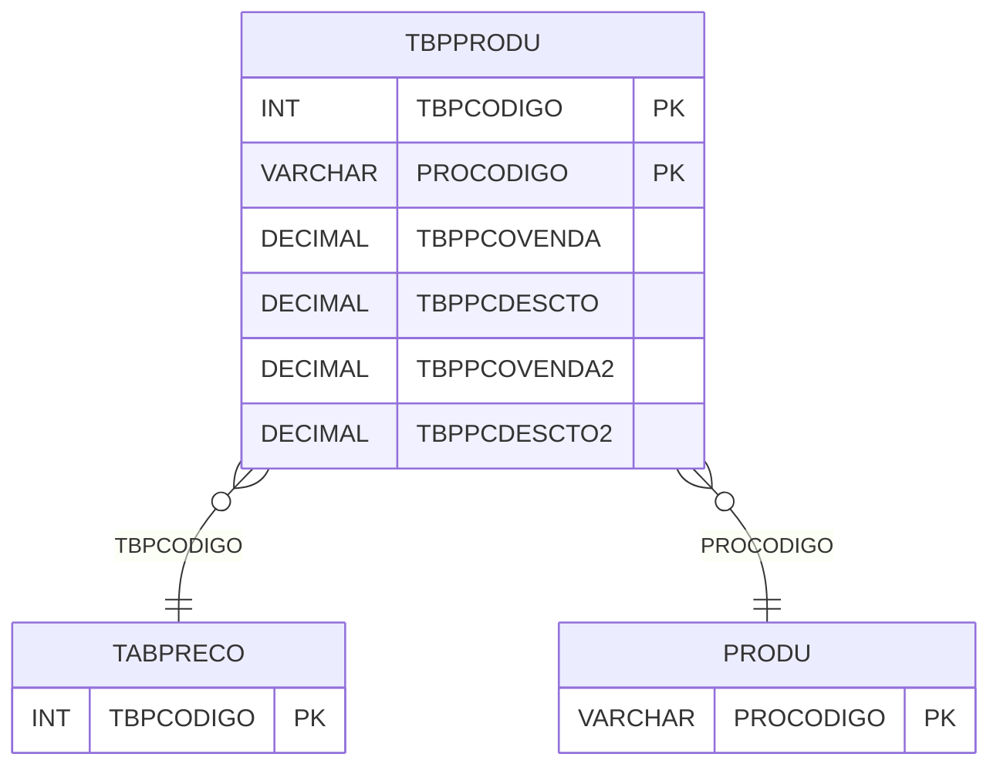

# TBPPRODU - Documentação Completa de Relacionamentos

## 📊 Informações Gerais

- **Nome da Tabela**: TBPPRODU (Tabela Preço Produto)
- **Total de Registros**: 24.852
- **Total de Colunas**: 6
- **Chave Primária**: TBPCODIGO, PROCODIGO (composite)
- **Chaves Estrangeiras**: 2
- **Índices**: 0
- **Tabelas Dependentes**: 0
- **Banco de Dados**: Firebird

## 📝 Descrição

**TBPPRODU** é uma tabela intermediária que armazena preços de produtos por tabela de preço. Com **24.852 registros**, esta tabela registra preços de venda e descontos para cada combinação de tabela de preço e produto.

Esta tabela é essencial para:
- **Preços**: Gerenciar preços de produtos por tabela
- **Descontos**: Armazenar descontos por produto
- **Rastreamento**: Rastrear preços por tabela
- **Relatórios**: Gerar relatórios de preços

---

## 🔑 Estrutura de Colunas

| Coluna | Tipo | Descrição |
|--------|------|-----------|
| **TBPCODIGO** 🔑 🔗 | INT | Código da tabela de preço (PK, FK → TABPRECO) |
| **PROCODIGO** 🔑 🔗 | VARCHAR(14) | Código do produto (PK, FK → PRODU) |
| **TBPPCOVENDA** | DECIMAL(18,2) | Percentual de venda |
| **TBPPCDESCTO** | DECIMAL(18,2) | Percentual de desconto |
| **TBPPCOVENDA2** | DECIMAL(18,2) | Percentual de venda 2 |
| **TBPPCDESCTO2** | DECIMAL(18,2) | Percentual de desconto 2 |

---

## 🔗 Relacionamentos - Nível 1 (Diretos)

### TABPRECO - Tabela Preço (FK Obrigatória)
**Volume:** 112 registros

**Relacionamento:**
```
TBPPRODU.TBPCODIGO → TABPRECO.TBPCODIGO (N:1)
Constraint: TABPRECO_TBPPRODU
```

### PRODU - Produto (FK Obrigatória)
**Volume:** Variável

**Relacionamento:**
```
TBPPRODU.PROCODIGO → PRODU.PROCODIGO (N:1)
Constraint: PRODU_TBPPRODU
```

**Proporção:** ~221 produtos por tabela em média (24.852 / 112)

---

## 🗺️ Diagrama de Relacionamentos



---

## 💡 Exemplos de Uso

### Consulta Básica

```sql
SELECT TBPCODIGO, PROCODIGO, TBPPCOVENDA, TBPPCDESCTO, TBPPCOVENDA2, TBPPCDESCTO2
FROM TBPPRODU
WHERE TBPCODIGO = ? AND PROCODIGO = ?;
```

---

## ⚡ Performance e Otimização

### Índices Recomendados

#### 1. Índice Composto na Chave Primária (Já existe implicitamente)
```sql
-- Índice primário já existe implicitamente
```

---

## 📊 Estatísticas e Insights

- **Total de Registros**: 24.852
- **Média por Tabela**: ~221 produtos por tabela

---

**Documentação gerada em**: 2025-01-27

**Banco de dados**: Firebird

