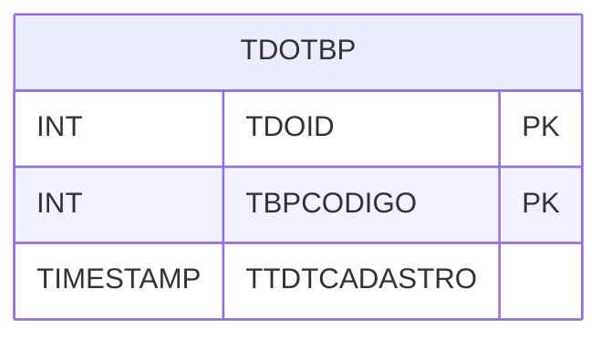

# TDOTBP - Documentação Completa de Relacionamentos

## 📊 Informações Gerais

- **Nome da Tabela**: TDOTBP (Tabela Desconto Origem Tabela Preço)
- **Total de Registros**: 2.711
- **Total de Colunas**: 3
- **Chave Primária**: TDOID, TBPCODIGO (composite)
- **Chaves Estrangeiras**: 0
- **Índices**: 0
- **Tabelas Dependentes**: 0
- **Banco de Dados**: Firebird

## 📝 Descrição

**TDOTBP** é uma tabela de relacionamento que associa descontos por origem de pedido (TABDESCORIGEMPD) com tabelas de preço. Com **2.711 registros**, esta tabela registra quais tabelas de preço estão associadas a quais configurações de desconto por origem.

Esta tabela é essencial para:
- **Descontos**: Gerenciar descontos por origem e tabela de preço
- **Rastreamento**: Rastrear associações de desconto
- **Relatórios**: Gerar relatórios de descontos

---

## 🔑 Estrutura de Colunas

| Coluna | Tipo | Descrição |
|--------|------|-----------|
| **TDOID** 🔑 | INT | ID do desconto por origem (PK) |
| **TBPCODIGO** 🔑 | INT | Código da tabela de preço (PK) |
| **TTDTCADASTRO** | TIMESTAMP | Data de cadastro |

---

## 🗺️ Diagrama de Relacionamentos



---

## 💡 Exemplos de Uso

### Consulta Básica

```sql
SELECT TDOID, TBPCODIGO, TTDTCADASTRO
FROM TDOTBP
WHERE TDOID = ?;
```

---

## ⚡ Performance e Otimização

### Índices Recomendados

#### 1. Índice Composto na Chave Primária (Já existe implicitamente)
```sql
-- Índice primário já existe implicitamente
```

---

## 📊 Estatísticas e Insights

- **Total de Registros**: 2.711
- **Associações**: 2.711 associações de desconto por tabela de preço

---

**Documentação gerada em**: 2025-01-27

**Banco de dados**: Firebird

