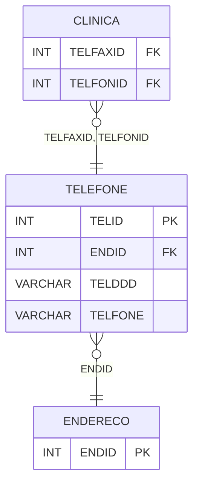

# TELEFONE - Documentação Completa de Relacionamentos

## 📊 Informações Gerais

- **Nome da Tabela**: TELEFONE
- **Total de Registros**: 4.760
- **Total de Colunas**: 4
- **Chave Primária**: TELID
- **Chaves Estrangeiras**: 1
- **Índices**: 0
- **Tabelas Dependentes**: 4
- **Banco de Dados**: Firebird

## 📝 Descrição

**TELEFONE** é uma tabela intermediária que armazena informações sobre telefones associados a endereços. Com **4.760 registros**, esta tabela registra números de telefone com DDD e número, vinculados a endereços específicos.

Esta tabela é essencial para:
- **Telefones**: Gerenciar telefones por endereço
- **Rastreamento**: Rastrear telefones disponíveis
- **Relatórios**: Gerar relatórios de telefones

---

## 🔑 Estrutura de Colunas

| Coluna | Tipo | Descrição |
|--------|------|-----------|
| **TELID** 🔑 | INT | Identificador único do telefone (PK) |
| **ENDID** 🔗 | INT | ID do endereço (FK → ENDERECO) |
| **TELDDD** | VARCHAR(37) | DDD do telefone |
| **TELFONE** | VARCHAR(37) | Número do telefone |

---

## 🔗 Relacionamentos - Nível 1 (Diretos)

### ENDERECO - Endereço (FK Opcional)
**Volume:** Variável

**Relacionamento:**
```
TELEFONE.ENDID → ENDERECO.ENDID (N:1)
Constraint: ENDERECO_TELEFONE
```

---

## 📊 Tabelas que Referenciam Esta

Esta tabela é referenciada por 4 tabelas:

### CLINICA - Clínica
**Volume:** Variável

**Relacionamento:**
```
CLINICA.TELFAXID → TELEFONE.TELID (N:1)
CLINICA.TELFONID → TELEFONE.TELID (N:1)
Constraint: TELEFONE_CLINICA_TELFAXID, TELEFONE_CLINICA_TELFONID
```

### USUARIOWEBDETALHES - Usuário Web Detalhes
**Volume:** Variável

**Relacionamento:**
```
USUARIOWEBDETALHES.TELCELID → TELEFONE.TELID (N:1)
USUARIOWEBDETALHES.TELFONID → TELEFONE.TELID (N:1)
Constraint: TELEFONE_USUARIOWEBDETALHES_CEL, TELEFONE_USUARIOWEBDETALHES_FON
```

---

## 🗺️ Diagrama de Relacionamentos



---

## 💡 Exemplos de Uso

### Consulta Básica

```sql
SELECT TELID, ENDID, TELDDD, TELFONE
FROM TELEFONE
WHERE TELID = ?;
```

### Consulta com Endereço

```sql
SELECT 
    t.*,
    e.ENDRUA,
    e.ENDNUMERO
FROM TELEFONE t
LEFT JOIN ENDERECO e
    ON t.ENDID = e.ENDID
WHERE t.TELID = ?;
```

---

## ⚡ Performance e Otimização

### Índices Recomendados

#### 1. Índice na Chave Primária (Já existe implicitamente)
```sql
-- Índice primário já existe implicitamente
```

#### 2. Índice em ENDID
```sql
CREATE INDEX IDX_TELEFONE_ENDERECO 
ON TELEFONE (ENDID);
```

**Justificativa:** Facilita buscas por endereço.

---

## 📊 Estatísticas e Insights

- **Total de Registros**: 4.760
- **Telefones**: 4.760 telefones cadastrados

---

**Documentação gerada em**: 2025-01-27

**Banco de dados**: Firebird

