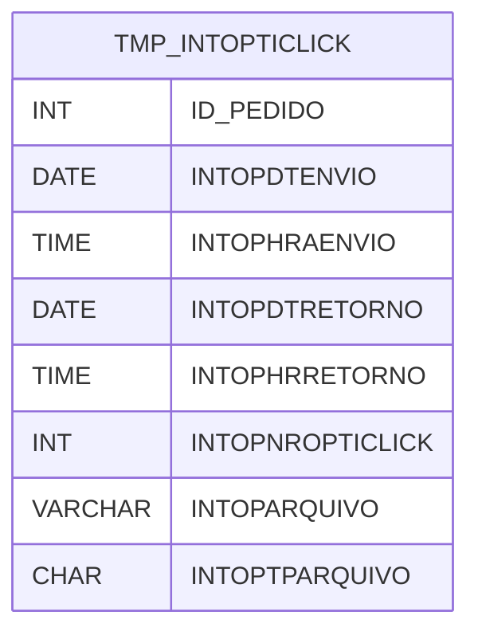

# TMP_INTOPTICLICK - Documentação Completa de Relacionamentos

## 📊 Informações Gerais

- **Nome da Tabela**: TMP_INTOPTICLICK (Temporária Integração OptClick)
- **Total de Registros**: 18.994
- **Total de Colunas**: 8
- **Chave Primária**: Nenhuma
- **Chaves Estrangeiras**: 0
- **Índices**: 0
- **Tabelas Dependentes**: 0
- **Banco de Dados**: Firebird

## 📝 Descrição

**TMP_INTOPTICLICK** é uma tabela temporária que armazena informações sobre integração com o sistema OptClick. Com **18.994 registros**, esta tabela registra pedidos enviados para o OptClick, incluindo datas e horários de envio e retorno, número do OptClick e arquivo associado.

Esta tabela é essencial para:
- **Integração OptClick**: Gerenciar integração com OptClick
- **Rastreamento**: Rastrear envios e retornos
- **Auditoria**: Manter histórico de integrações
- **Relatórios**: Gerar relatórios de integração

**Contexto de Negócio:**
Esta é uma tabela temporária utilizada para processamento de integração com o sistema OptClick. Os dados podem ser limpos periodicamente após processamento.

---

## 🔑 Estrutura de Colunas

| Coluna | Tipo | Descrição |
|--------|------|-----------|
| **ID_PEDIDO** | INT | Código do pedido |
| **INTOPDTENVIO** | DATE | Data de envio |
| **INTOPHRAENVIO** | TIME | Hora de envio |
| **INTOPDTRETORNO** | DATE | Data de retorno |
| **INTOPHRRETORNO** | TIME | Hora de retorno |
| **INTOPNROPTICLICK** | INT | Número do OptClick |
| **INTOPARQUIVO** | VARCHAR(261) | Caminho do arquivo |
| **INTOPTPARQUIVO** | CHAR(1) | Tipo do arquivo |

---

## 🗺️ Diagrama de Relacionamentos



---

## 💡 Exemplos de Uso

### Consulta Básica

```sql
SELECT ID_PEDIDO, INTOPDTENVIO, INTOPHRAENVIO, INTOPDTRETORNO, INTOPHRRETORNO, INTOPNROPTICLICK, INTOPARQUIVO, INTOPTPARQUIVO
FROM TMP_INTOPTICLICK
WHERE ID_PEDIDO = ?;
```

### Consulta de Pedidos Pendentes

```sql
SELECT *
FROM TMP_INTOPTICLICK
WHERE INTOPDTRETORNO IS NULL
ORDER BY INTOPDTENVIO DESC;
```

---

## ⚡ Performance e Otimização

### Índices Recomendados

#### 1. Índice em ID_PEDIDO
```sql
CREATE INDEX IDX_TMP_INTOPTICLICK_PEDIDO 
ON TMP_INTOPTICLICK (ID_PEDIDO);
```

**Justificativa:** Facilita buscas por pedido.

#### 2. Índice em INTOPDTENVIO
```sql
CREATE INDEX IDX_TMP_INTOPTICLICK_ENVIO 
ON TMP_INTOPTICLICK (INTOPDTENVIO);
```

**Justificativa:** Facilita consultas por data de envio.

---

## 📊 Estatísticas e Insights

- **Total de Registros**: 18.994
- **Integrações**: 18.994 registros de integração com OptClick

---

**Documentação gerada em**: 2025-01-27

**Banco de dados**: Firebird

