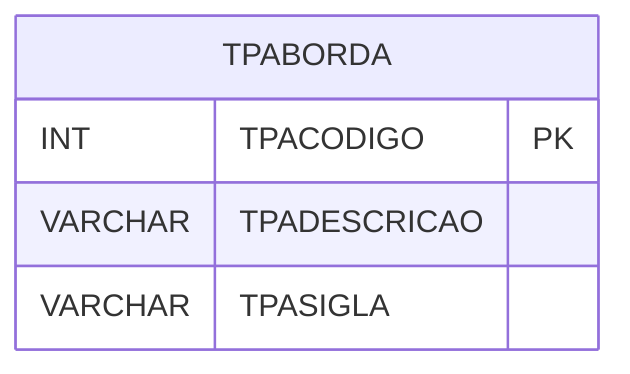

# TPABORDA - Documentação Completa de Relacionamentos

## 📊 Informações Gerais

- **Nome da Tabela**: TPABORDA (Tipo Aborda)
- **Total de Registros**: 1
- **Total de Colunas**: 3
- **Chave Primária**: TPACODIGO
- **Chaves Estrangeiras**: 0
- **Índices**: 0
- **Tabelas Dependentes**: 0
- **Banco de Dados**: Firebird

## 📝 Descrição

**TPABORDA** é uma tabela mestre de configuração que armazena informações sobre tipos de aborda. Com apenas **1 registro**, esta tabela define tipos de aborda disponíveis no sistema, incluindo descrição e sigla.

Esta tabela é essencial para:
- **Configuração**: Armazenar configurações de aborda
- **Rastreamento**: Rastrear tipos disponíveis
- **Relatórios**: Gerar relatórios de aborda

---

## 🔑 Estrutura de Colunas

| Coluna | Tipo | Descrição |
|--------|------|-----------|
| **TPACODIGO** 🔑 | INT | Código do tipo de aborda (PK) |
| **TPADESCRICAO** | VARCHAR(14) | Descrição do tipo |
| **TPASIGLA** | VARCHAR(14) | Sigla do tipo |

---

## 🗺️ Diagrama de Relacionamentos



---

## 💡 Exemplos de Uso

### Consulta Básica

```sql
SELECT TPACODIGO, TPADESCRICAO, TPASIGLA
FROM TPABORDA
WHERE TPACODIGO = ?;
```

---

## ⚡ Performance e Otimização

### Índices Recomendados

#### 1. Índice na Chave Primária (Já existe implicitamente)
```sql
-- Índice primário já existe implicitamente
```

---

## 📊 Estatísticas e Insights

- **Total de Registros**: 1
- **Uso**: Tabela de configuração com volume mínimo

---

**Documentação gerada em**: 2025-01-27

**Banco de dados**: Firebird

