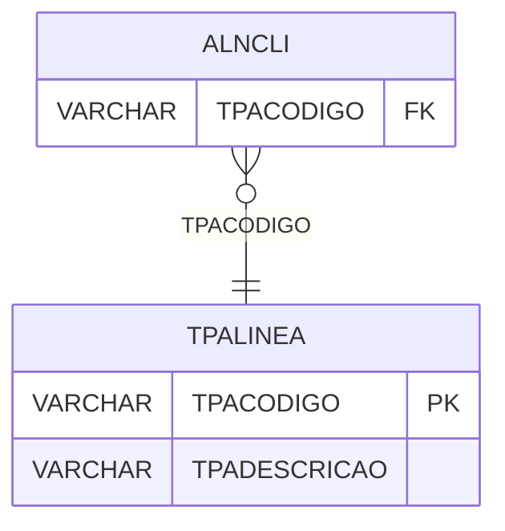

# TPALINEA - Documentação Completa de Relacionamentos

## 📊 Informações Gerais

- **Nome da Tabela**: TPALINEA (Tipo Alínea)
- **Total de Registros**: 3
- **Total de Colunas**: 2
- **Chave Primária**: TPACODIGO
- **Chaves Estrangeiras**: 0
- **Índices**: 0
- **Tabelas Dependentes**: 1
- **Banco de Dados**: Firebird

## 📝 Descrição

**TPALINEA** é uma tabela mestre que armazena informações sobre tipos de alínea. Com apenas **3 registros**, esta tabela define tipos de alínea disponíveis no sistema, incluindo descrição.

Esta tabela é essencial para:
- **Alínea**: Gerenciar tipos de alínea
- **Configuração**: Armazenar configurações de alínea
- **Rastreamento**: Rastrear tipos disponíveis
- **Relatórios**: Gerar relatórios de alínea

---

## 🔑 Estrutura de Colunas

| Coluna | Tipo | Descrição |
|--------|------|-----------|
| **TPACODIGO** 🔑 | VARCHAR(14) | Código do tipo de alínea (PK) |
| **TPADESCRICAO** | VARCHAR(37) | Descrição do tipo |

---

## 📊 Tabelas que Referenciam Esta

Esta tabela é referenciada por 1 tabela:

### ALNCLI - Alínea Cliente
**Volume:** Variável

**Relacionamento:**
```
ALNCLI.TPACODIGO → TPALINEA.TPACODIGO (N:1)
Constraint: ALNCLI_TPALINEA
```

---

## 🗺️ Diagrama de Relacionamentos



---

## 💡 Exemplos de Uso

### Consulta Básica

```sql
SELECT TPACODIGO, TPADESCRICAO
FROM TPALINEA
WHERE TPACODIGO = ?;
```

---

## ⚡ Performance e Otimização

### Índices Recomendados

#### 1. Índice na Chave Primária (Já existe implicitamente)
```sql
-- Índice primário já existe implicitamente
```

---

## 📊 Estatísticas e Insights

- **Total de Registros**: 3
- **Tipos**: 3 tipos de alínea cadastrados

---

**Documentação gerada em**: 2025-01-27

**Banco de dados**: Firebird

