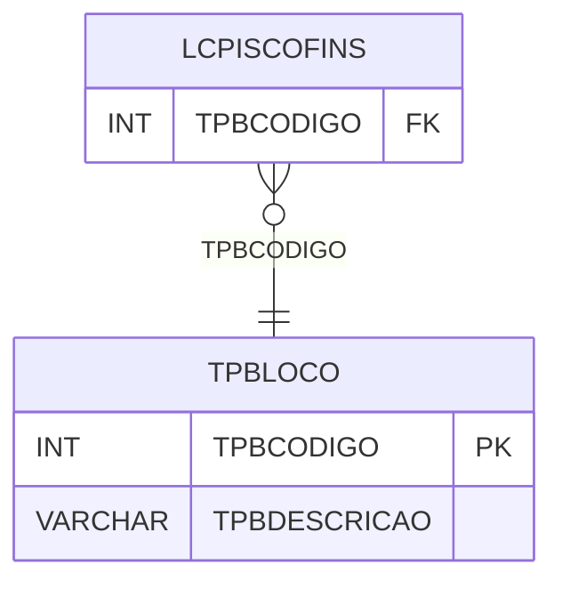

# TPBLOCO - Documentação Completa de Relacionamentos

## 📊 Informações Gerais

- **Nome da Tabela**: TPBLOCO (Tipo Bloco)
- **Total de Registros**: 18
- **Total de Colunas**: 2
- **Chave Primária**: TPBCODIGO
- **Chaves Estrangeiras**: 0
- **Índices**: 0
- **Tabelas Dependentes**: 1
- **Banco de Dados**: Firebird

## 📝 Descrição

**TPBLOCO** é uma tabela mestre que armazena informações sobre tipos de bloco. Com **18 registros**, esta tabela define tipos de bloco disponíveis no sistema, incluindo descrição.

Esta tabela é essencial para:
- **Bloco**: Gerenciar tipos de bloco
- **Configuração**: Armazenar configurações de bloco
- **Rastreamento**: Rastrear tipos disponíveis
- **Relatórios**: Gerar relatórios de bloco

---

## 🔑 Estrutura de Colunas

| Coluna | Tipo | Descrição |
|--------|------|-----------|
| **TPBCODIGO** 🔑 | INT | Código do tipo de bloco (PK) |
| **TPBDESCRICAO** | VARCHAR(37) | Descrição do tipo |

---

## 📊 Tabelas que Referenciam Esta

Esta tabela é referenciada por 1 tabela:

### LCPISCOFINS - Lançamento Contábil PIS COFINS
**Volume:** Variável

**Relacionamento:**
```
LCPISCOFINS.TPBCODIGO → TPBLOCO.TPBCODIGO (N:1)
Constraint: TPBLOCO_LCPISCOFINS
```

---

## 🗺️ Diagrama de Relacionamentos



---

## 💡 Exemplos de Uso

### Consulta Básica

```sql
SELECT TPBCODIGO, TPBDESCRICAO
FROM TPBLOCO
WHERE TPBCODIGO = ?;
```

---

## ⚡ Performance e Otimização

### Índices Recomendados

#### 1. Índice na Chave Primária (Já existe implicitamente)
```sql
-- Índice primário já existe implicitamente
```

---

## 📊 Estatísticas e Insights

- **Total de Registros**: 18
- **Tipos**: 18 tipos de bloco cadastrados

---

**Documentação gerada em**: 2025-01-27

**Banco de dados**: Firebird

