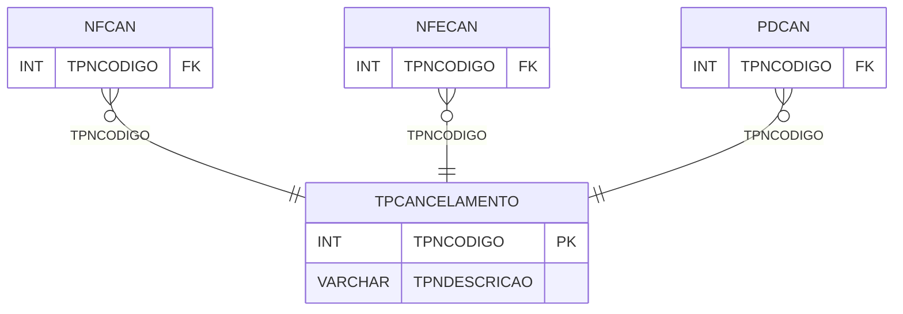

# TPCANCELAMENTO - Documentação Completa de Relacionamentos

## 📊 Informações Gerais

- **Nome da Tabela**: TPCANCELAMENTO (Tipo Cancelamento)
- **Total de Registros**: 10
- **Total de Colunas**: 2
- **Chave Primária**: TPNCODIGO
- **Chaves Estrangeiras**: 0
- **Índices**: 0
- **Tabelas Dependentes**: 10
- **Banco de Dados**: Firebird

## 📝 Descrição

**TPCANCELAMENTO** é uma tabela mestre que armazena informações sobre tipos de cancelamento. Com **10 registros**, esta tabela define tipos de cancelamento disponíveis no sistema, incluindo descrição.

Esta tabela é essencial para:
- **Cancelamento**: Gerenciar tipos de cancelamento
- **Configuração**: Armazenar configurações de cancelamento
- **Rastreamento**: Rastrear tipos disponíveis
- **Relatórios**: Gerar relatórios de cancelamento

---

## 🔑 Estrutura de Colunas

| Coluna | Tipo | Descrição |
|--------|------|-----------|
| **TPNCODIGO** 🔑 | INT | Código do tipo de cancelamento (PK) |
| **TPNDESCRICAO** | VARCHAR(37) | Descrição do tipo |

---

## 📊 Tabelas que Referenciam Esta

Esta tabela é referenciada por 10 tabelas:

### NFCAN - NF Cancelamento
**Volume:** Variável

**Relacionamento:**
```
NFCAN.TPNCODIGO → TPCANCELAMENTO.TPNCODIGO (N:1)
Constraint: TPCANCELAMENTO_NFCAN
```

### NFECAN - NFe Cancelamento
**Volume:** Variável

**Relacionamento:**
```
NFECAN.TPNCODIGO → TPCANCELAMENTO.TPNCODIGO (N:1)
Constraint: TPCANCELAMENTO_NFECAN
```

### ORCCAN - Orçamento Cancelamento
**Volume:** Variável

**Relacionamento:**
```
ORCCAN.TPNCODIGO → TPCANCELAMENTO.TPNCODIGO (N:1)
Constraint: TPCANCELAMENTO_ORCCAN
```

### PAGCAN - Pagar Cancelamento
**Volume:** Variável

**Relacionamento:**
```
PAGCAN.TPNCODIGO → TPCANCELAMENTO.TPNCODIGO (N:1)
Constraint: TPCANCELAMENTO_PAGCAN
```

### PAGPCAN - Pagar Provisório Cancelamento
**Volume:** Variável

**Relacionamento:**
```
PAGPCAN.TPNCODIGO → TPCANCELAMENTO.TPNCODIGO (N:1)
Constraint: TPCANCELAMENTO_PAGPCAN
```

### PCTCAN - Pedido Cliente Cancelamento
**Volume:** Variável

**Relacionamento:**
```
PCTCAN.TPNCODIGO → TPCANCELAMENTO.TPNCODIGO (N:1)
Constraint: TPCANCELAMENTO_PCTCAN
```

### PDCAN - Pedido Cancelamento
**Volume:** Variável

**Relacionamento:**
```
PDCAN.TPNCODIGO → TPCANCELAMENTO.TPNCODIGO (N:1)
Constraint: TPCANCELAMENTO_PDCAN
```

### PFCAN - Pedido Fornecedor Cancelamento
**Volume:** Variável

**Relacionamento:**
```
PFCAN.TPNCODIGO → TPCANCELAMENTO.TPNCODIGO (N:1)
Constraint: TPCANCELAMENTO_PFCAN
```

### RECCAN - Receber Cancelamento
**Volume:** Variável

**Relacionamento:**
```
RECCAN.TPNCODIGO → TPCANCELAMENTO.TPNCODIGO (N:1)
Constraint: TPCANCELAMENTO_RECCAN
```

### RECPCAN - Receber Provisório Cancelamento
**Volume:** Variável

**Relacionamento:**
```
RECPCAN.TPNCODIGO → TPCANCELAMENTO.TPNCODIGO (N:1)
Constraint: TPCANCELAMENTO_RECPCAN
```

---

## 🗺️ Diagrama de Relacionamentos



---

## 💡 Exemplos de Uso

### Consulta Básica

```sql
SELECT TPNCODIGO, TPNDESCRICAO
FROM TPCANCELAMENTO
WHERE TPNCODIGO = ?;
```

---

## ⚡ Performance e Otimização

### Índices Recomendados

#### 1. Índice na Chave Primária (Já existe implicitamente)
```sql
-- Índice primário já existe implicitamente
```

---

## 📊 Estatísticas e Insights

- **Total de Registros**: 10
- **Tipos**: 10 tipos de cancelamento cadastrados

---

**Documentação gerada em**: 2025-01-27

**Banco de dados**: Firebird

