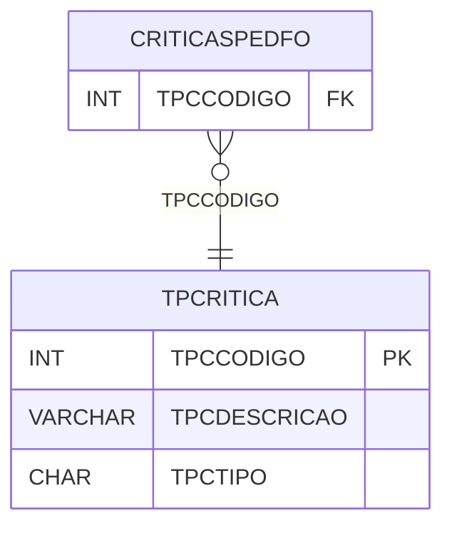

# TPCRITICA - Documentação Completa de Relacionamentos

## 📊 Informações Gerais

- **Nome da Tabela**: TPCRITICA (Tipo Crítica)
- **Total de Registros**: 13
- **Total de Colunas**: 3
- **Chave Primária**: TPCCODIGO
- **Chaves Estrangeiras**: 0
- **Índices**: 0
- **Tabelas Dependentes**: 1
- **Banco de Dados**: Firebird

## 📝 Descrição

**TPCRITICA** é uma tabela mestre que armazena informações sobre tipos de crítica. Com **13 registros**, esta tabela define tipos de crítica disponíveis no sistema, incluindo descrição e tipo.

Esta tabela é essencial para:
- **Crítica**: Gerenciar tipos de crítica
- **Configuração**: Armazenar configurações de crítica
- **Rastreamento**: Rastrear tipos disponíveis
- **Relatórios**: Gerar relatórios de crítica

---

## 🔑 Estrutura de Colunas

| Coluna | Tipo | Descrição |
|--------|------|-----------|
| **TPCCODIGO** 🔑 | INT | Código do tipo de crítica (PK) |
| **TPCDESCRICAO** | VARCHAR(37) | Descrição do tipo |
| **TPCTIPO** | CHAR(1) | Tipo da crítica |

---

## 📊 Tabelas que Referenciam Esta

Esta tabela é referenciada por 1 tabela:

### CRITICASPEDFO - Críticas Pedido Fornecedor
**Volume:** Variável

**Relacionamento:**
```
CRITICASPEDFO.TPCCODIGO → TPCRITICA.TPCCODIGO (N:1)
Constraint: FK_CRITICASPEDFO_TPCRITICA
```

---

## 🗺️ Diagrama de Relacionamentos



---

## 💡 Exemplos de Uso

### Consulta Básica

```sql
SELECT TPCCODIGO, TPCDESCRICAO, TPCTIPO
FROM TPCRITICA
WHERE TPCCODIGO = ?;
```

---

## ⚡ Performance e Otimização

### Índices Recomendados

#### 1. Índice na Chave Primária (Já existe implicitamente)
```sql
-- Índice primário já existe implicitamente
```

---

## 📊 Estatísticas e Insights

- **Total de Registros**: 13
- **Tipos**: 13 tipos de crítica cadastrados

---

**Documentação gerada em**: 2025-01-27

**Banco de dados**: Firebird

