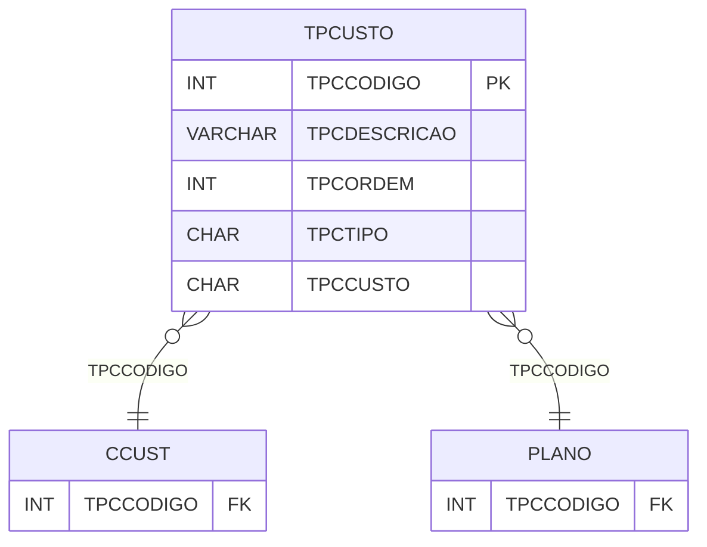

# TPCUSTO - Documentação Completa de Relacionamentos

## 📊 Informações Gerais

- **Nome da Tabela**: TPCUSTO (Tipo Custo)
- **Total de Registros**: 70
- **Total de Colunas**: 5
- **Chave Primária**: TPCCODIGO
- **Chaves Estrangeiras**: 0
- **Índices**: 0
- **Tabelas Dependentes**: 3
- **Banco de Dados**: Firebird

## 📝 Descrição

**TPCUSTO** é uma tabela mestre que armazena informações sobre tipos de custo. Com **70 registros**, esta tabela define tipos de custo disponíveis no sistema, incluindo descrição, ordem, tipo e código de custo.

Esta tabela é essencial para:
- **Custo**: Gerenciar tipos de custo
- **Configuração**: Armazenar configurações de custo
- **Rastreamento**: Rastrear tipos disponíveis
- **Relatórios**: Gerar relatórios de custo

---

## 🔑 Estrutura de Colunas

| Coluna | Tipo | Descrição |
|--------|------|-----------|
| **TPCCODIGO** 🔑 | INT | Código do tipo de custo (PK) |
| **TPCDESCRICAO** | VARCHAR(37) | Descrição do tipo |
| **TPCORDEM** | INT | Ordem de exibição |
| **TPCTIPO** | CHAR(1) | Tipo do custo |
| **TPCCUSTO** | CHAR(1) | Código do custo |

---

## 📊 Tabelas que Referenciam Esta

Esta tabela é referenciada por 3 tabelas:

### CCUST - Centro de Custo
**Volume:** Variável

**Relacionamento:**
```
CCUST.TPCCODIGO → TPCUSTO.TPCCODIGO (N:1)
Constraint: TPCUSTO_CCUST
```

### PLANO - Plano
**Volume:** Variável

**Relacionamento:**
```
PLANO.TPCCODIGO → TPCUSTO.TPCCODIGO (N:1)
Constraint: TPCUSTO_PLANO
```

### TPANALISELUC - Tipo Análise Lucro
**Volume:** Variável

**Relacionamento:**
```
TPANALISELUC.TPCCODIGO → TPCUSTO.TPCCODIGO (N:1)
Constraint: TPANALISELUC_TPCUSTO
```

---

## 🗺️ Diagrama de Relacionamentos



---

## 💡 Exemplos de Uso

### Consulta Básica

```sql
SELECT TPCCODIGO, TPCDESCRICAO, TPCORDEM, TPCTIPO, TPCCUSTO
FROM TPCUSTO
WHERE TPCCODIGO = ?;
```

---

## ⚡ Performance e Otimização

### Índices Recomendados

#### 1. Índice na Chave Primária (Já existe implicitamente)
```sql
-- Índice primário já existe implicitamente
```

---

## 📊 Estatísticas e Insights

- **Total de Registros**: 70
- **Tipos**: 70 tipos de custo cadastrados

---

**Documentação gerada em**: 2025-01-27

**Banco de dados**: Firebird

