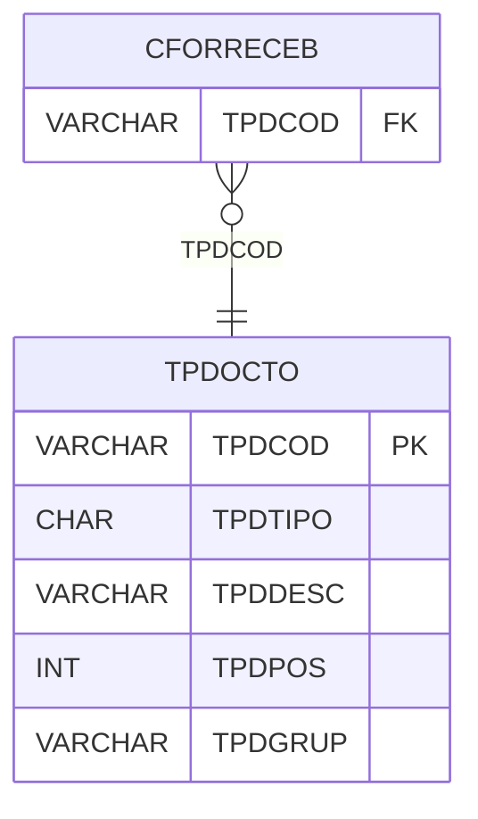

# TPDOCTO - Documentação Completa de Relacionamentos

## 📊 Informações Gerais

- **Nome da Tabela**: TPDOCTO (Tipo Documento)
- **Total de Registros**: 9
- **Total de Colunas**: 5
- **Chave Primária**: TPDCOD
- **Chaves Estrangeiras**: 0
- **Índices**: 0
- **Tabelas Dependentes**: 1
- **Banco de Dados**: Firebird

## 📝 Descrição

**TPDOCTO** é uma tabela mestre que armazena informações sobre tipos de documento. Com **9 registros**, esta tabela define tipos de documento disponíveis no sistema, incluindo tipo, descrição, posição e grupo.

Esta tabela é essencial para:
- **Documento**: Gerenciar tipos de documento
- **Configuração**: Armazenar configurações de documento
- **Rastreamento**: Rastrear tipos disponíveis
- **Relatórios**: Gerar relatórios de documento

---

## 🔑 Estrutura de Colunas

| Coluna | Tipo | Descrição |
|--------|------|-----------|
| **TPDCOD** 🔑 | VARCHAR(14) | Código do tipo de documento (PK) |
| **TPDTIPO** | CHAR(1) | Tipo do documento |
| **TPDDESC** | VARCHAR(37) | Descrição do tipo |
| **TPDPOS** | INT | Posição de exibição |
| **TPDGRUP** | VARCHAR(14) | Grupo do documento |

---

## 📊 Tabelas que Referenciam Esta

Esta tabela é referenciada por 1 tabela:

### CFORRECEB - Condição Forma Receber
**Volume:** Variável

**Relacionamento:**
```
CFORRECEB.TPDCOD → TPDOCTO.TPDCOD (N:1)
Constraint: FK_CFORRECEB_1
```

---

## 🗺️ Diagrama de Relacionamentos



---

## 💡 Exemplos de Uso

### Consulta Básica

```sql
SELECT TPDCOD, TPDTIPO, TPDDESC, TPDPOS, TPDGRUP
FROM TPDOCTO
WHERE TPDCOD = ?;
```

---

## ⚡ Performance e Otimização

### Índices Recomendados

#### 1. Índice na Chave Primária (Já existe implicitamente)
```sql
-- Índice primário já existe implicitamente
```

---

## 📊 Estatísticas e Insights

- **Total de Registros**: 9
- **Tipos**: 9 tipos de documento cadastrados

---

**Documentação gerada em**: 2025-01-27

**Banco de dados**: Firebird

