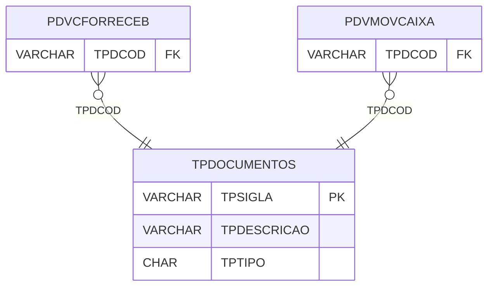

# TPDOCUMENTOS - Documentação Completa de Relacionamentos

## 📊 Informações Gerais

- **Nome da Tabela**: TPDOCUMENTOS (Tipo Documentos)
- **Total de Registros**: 21
- **Total de Colunas**: 3
- **Chave Primária**: TPSIGLA
- **Chaves Estrangeiras**: 0
- **Índices**: 0
- **Tabelas Dependentes**: 2
- **Banco de Dados**: Firebird

## 📝 Descrição

**TPDOCUMENTOS** é uma tabela mestre que armazena informações sobre tipos de documentos. Com **21 registros**, esta tabela define tipos de documentos disponíveis no sistema, incluindo sigla, descrição e tipo.

Esta tabela é essencial para:
- **Documento**: Gerenciar tipos de documentos
- **Configuração**: Armazenar configurações de documentos
- **Rastreamento**: Rastrear tipos disponíveis
- **Relatórios**: Gerar relatórios de documentos

---

## 🔑 Estrutura de Colunas

| Coluna | Tipo | Descrição |
|--------|------|-----------|
| **TPSIGLA** 🔑 | VARCHAR(14) | Sigla do tipo de documento (PK) |
| **TPDESCRICAO** | VARCHAR(37) | Descrição do tipo |
| **TPTIPO** | CHAR(1) | Tipo do documento |

---

## 📊 Tabelas que Referenciam Esta

Esta tabela é referenciada por 2 tabelas:

### PDVCFORRECEB - PDV Condição Forma Receber
**Volume:** Variável

**Relacionamento:**
```
PDVCFORRECEB.TPDCOD → TPDOCUMENTOS.TPSIGLA (N:1)
Constraint: XFK_PDVCFORRECEB_TPDOCTO
```

### PDVMOVCAIXA - PDV Movimento Caixa
**Volume:** Variável

**Relacionamento:**
```
PDVMOVCAIXA.TPDCOD → TPDOCUMENTOS.TPSIGLA (N:1)
Constraint: XFK_PDVMOVCAIXA_TPDOCTO
```

---

## 🗺️ Diagrama de Relacionamentos



---

## 💡 Exemplos de Uso

### Consulta Básica

```sql
SELECT TPSIGLA, TPDESCRICAO, TPTIPO
FROM TPDOCUMENTOS
WHERE TPSIGLA = ?;
```

---

## ⚡ Performance e Otimização

### Índices Recomendados

#### 1. Índice na Chave Primária (Já existe implicitamente)
```sql
-- Índice primário já existe implicitamente
```

---

## 📊 Estatísticas e Insights

- **Total de Registros**: 21
- **Tipos**: 21 tipos de documentos cadastrados

---

**Documentação gerada em**: 2025-01-27

**Banco de dados**: Firebird

