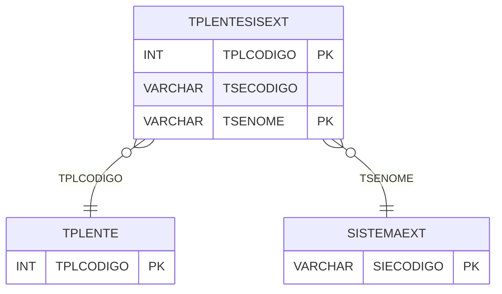

# TPLENTESISEXT - Documentação Completa de Relacionamentos

## 📊 Informações Gerais

- **Nome da Tabela**: TPLENTESISEXT (Tipo Lente Sistema Externo)
- **Total de Registros**: 21.693
- **Total de Colunas**: 3
- **Chave Primária**: TPLCODIGO, TSENOME (composite)
- **Chaves Estrangeiras**: 2
- **Índices**: 1
- **Tabelas Dependentes**: 0
- **Banco de Dados**: Firebird

## 📝 Descrição

**TPLENTESISEXT** é uma tabela intermediária que mapeia tipos de lentes para sistemas externos. Com **21.693 registros**, esta tabela registra códigos de tipos de lentes em sistemas externos, permitindo integração e sincronização entre o sistema interno e sistemas externos.

Esta tabela é essencial para:
- **Integração**: Gerenciar mapeamento de tipos de lentes para sistemas externos
- **Sincronização**: Facilitar sincronização de dados
- **Rastreamento**: Rastrear mapeamentos por sistema externo
- **Relatórios**: Gerar relatórios de integração

---

## 🔑 Estrutura de Colunas

| Coluna | Tipo | Descrição |
|--------|------|-----------|
| **TPLCODIGO** 🔑 🔗 | INT | Código do tipo de lente (PK, FK → TPLENTE) |
| **TSECODIGO** | VARCHAR(37) | Código no sistema externo |
| **TSENOME** 🔑 🔗 | VARCHAR(14) | Nome do sistema externo (PK, FK → SISTEMAEXT) |

---

## 🔗 Relacionamentos - Nível 1 (Diretos)

### TPLENTE - Tipo Lente (FK Obrigatória)
**Volume:** Variável

**Relacionamento:**
```
TPLENTESISEXT.TPLCODIGO → TPLENTE.TPLCODIGO (N:1)
Constraint: TPLENTE_TPLENTESISEXT
```

### SISTEMAEXT - Sistema Externo (FK Obrigatória)
**Volume:** 26 registros

**Relacionamento:**
```
TPLENTESISEXT.TSENOME → SISTEMAEXT.SIECODIGO (N:1)
Constraint: SISTEMAEXT_TPLENTESISEXT
```

**Proporção:** ~834 tipos de lentes por sistema externo em média (21.693 / 26)

---

## 📇 Índices

| Nome do Índice | Colunas | Único |
|----------------|---------|-------|
| IDX_TSECODIGO | TSECODIGO | Não |

---

## 🗺️ Diagrama de Relacionamentos



---

## 💡 Exemplos de Uso

### Consulta Básica

```sql
SELECT TPLCODIGO, TSECODIGO, TSENOME
FROM TPLENTESISEXT
WHERE TPLCODIGO = ? AND TSENOME = ?;
```

### Consulta com Informações do Tipo de Lente

```sql
SELECT 
    t.*,
    tl.TPLDESCRICAO,
    se.SIENOME
FROM TPLENTESISEXT t
INNER JOIN TPLENTE tl
    ON t.TPLCODIGO = tl.TPLCODIGO
INNER JOIN SISTEMAEXT se
    ON t.TSENOME = se.SIECODIGO
WHERE t.TPLCODIGO = ?;
```

---

## ⚡ Performance e Otimização

### Índices Recomendados

#### 1. Índice Composto na Chave Primária (Já existe implicitamente)
```sql
-- Índice primário já existe implicitamente
```

#### 2. Índice Existente
O índice em TSECODIGO já está criado e é adequado.

---

## 📊 Estatísticas e Insights

- **Total de Registros**: 21.693
- **Mapeamentos**: 21.693 mapeamentos de tipos de lentes para sistemas externos

---

**Documentação gerada em**: 2025-01-27

**Banco de dados**: Firebird

