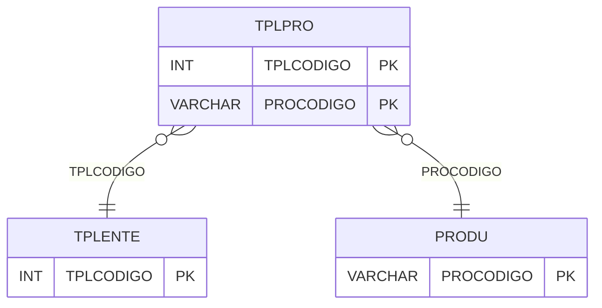

# TPLPRO - Documentação Completa de Relacionamentos

## 📊 Informações Gerais

- **Nome da Tabela**: TPLPRO (Tipo Lente Produto)
- **Total de Registros**: 496.482
- **Total de Colunas**: 2
- **Chave Primária**: TPLCODIGO, PROCODIGO (composite)
- **Chaves Estrangeiras**: 2
- **Índices**: 0
- **Tabelas Dependentes**: 0
- **Banco de Dados**: Firebird

## 📝 Descrição

**TPLPRO** é uma tabela intermediária de grande volume que associa tipos de lentes a produtos. Com **496.482 registros**, esta tabela registra quais produtos pertencem a quais tipos de lentes, permitindo classificação e busca de produtos por tipo de lente.

Esta tabela é essencial para:
- **Classificação**: Classificar produtos por tipo de lente
- **Busca**: Facilitar busca de produtos por tipo
- **Rastreamento**: Rastrear produtos por tipo de lente
- **Relatórios**: Gerar relatórios de produtos por tipo

**Contexto de Negócio:**
Esta é uma das tabelas com maior volume do sistema, refletindo a grande quantidade de produtos e tipos de lentes cadastrados. É fundamental para operações de busca e classificação de produtos.

---

## 🔑 Estrutura de Colunas

| Coluna | Tipo | Descrição |
|--------|------|-----------|
| **TPLCODIGO** 🔑 🔗 | INT | Código do tipo de lente (PK, FK → TPLENTE) |
| **PROCODIGO** 🔑 🔗 | VARCHAR(14) | Código do produto (PK, FK → PRODU) |

---

## 🔗 Relacionamentos - Nível 1 (Diretos)

### TPLENTE - Tipo Lente (FK Obrigatória)
**Volume:** Variável

**Relacionamento:**
```
TPLPRO.TPLCODIGO → TPLENTE.TPLCODIGO (N:1)
Constraint: TPLPRO_TPLENTE
```

### PRODU - Produto (FK Obrigatória)
**Volume:** Variável

**Relacionamento:**
```
TPLPRO.PROCODIGO → PRODU.PROCODIGO (N:1)
Constraint: PRODU_TPLENTE
```

---

## 🗺️ Diagrama de Relacionamentos



---

## 💡 Exemplos de Uso

### Consulta Básica

```sql
SELECT TPLCODIGO, PROCODIGO
FROM TPLPRO
WHERE TPLCODIGO = ?;
```

### Consulta com Informações do Produto

```sql
SELECT 
    t.*,
    p.PRODESCRICAO
FROM TPLPRO t
INNER JOIN PRODU p
    ON t.PROCODIGO = p.PROCODIGO
WHERE t.TPLCODIGO = ?;
```

---

## ⚡ Performance e Otimização

### Índices Recomendados

#### 1. Índice Composto na Chave Primária (Já existe implicitamente)
```sql
-- Índice primário já existe implicitamente
```

#### 2. Índice em PROCODIGO
```sql
CREATE INDEX IDX_TPLPRO_PRODUTO 
ON TPLPRO (PROCODIGO);
```

**Justificativa:** Facilita buscas por produto.

---

## 📊 Estatísticas e Insights

- **Total de Registros**: 496.482
- **Volume**: Uma das tabelas com maior volume do sistema

---

**Documentação gerada em**: 2025-01-27

**Banco de dados**: Firebird

