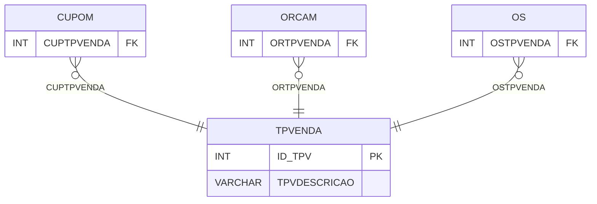

# TPVENDA - Documentação Completa de Relacionamentos

## 📊 Informações Gerais

- **Nome da Tabela**: TPVENDA (Tipo Venda)
- **Total de Registros**: 6
- **Total de Colunas**: 2
- **Chave Primária**: ID_TPV
- **Chaves Estrangeiras**: 0
- **Índices**: 0
- **Tabelas Dependentes**: 4
- **Banco de Dados**: Firebird

## 📝 Descrição

**TPVENDA** é uma tabela mestre que armazena informações sobre tipos de venda. Com apenas **6 registros**, esta tabela define tipos de venda disponíveis no sistema, incluindo descrição.

Esta tabela é essencial para:
- **Venda**: Gerenciar tipos de venda
- **Configuração**: Armazenar configurações de venda
- **Rastreamento**: Rastrear tipos disponíveis
- **Relatórios**: Gerar relatórios de venda

---

## 🔑 Estrutura de Colunas

| Coluna | Tipo | Descrição |
|--------|------|-----------|
| **ID_TPV** 🔑 | INT | Identificador único do tipo de venda (PK) |
| **TPVDESCRICAO** | VARCHAR(37) | Descrição do tipo |

---

## 📊 Tabelas que Referenciam Esta

Esta tabela é referenciada por 4 tabelas:

### CUPOM - Cupom
**Volume:** Variável

**Relacionamento:**
```
CUPOM.CUPTPVENDA → TPVENDA.ID_TPV (N:1)
Constraint: FK_CUPTPVENDA
```

### ORCAM - Orçamento
**Volume:** Variável

**Relacionamento:**
```
ORCAM.ORTPVENDA → TPVENDA.ID_TPV (N:1)
Constraint: FK_ORTPVENDA
```

### OS - Ordem de Serviço
**Volume:** Variável

**Relacionamento:**
```
OS.OSTPVENDA → TPVENDA.ID_TPV (N:1)
Constraint: FK_OSTPVENDA
```

### PEDIDORIGCAP - Pedido Origem Captura
**Volume:** Variável

**Relacionamento:**
```
PEDIDORIGCAP.POC_IDTPV → TPVENDA.ID_TPV (N:1)
Constraint: FKPOC_IDTPV
```

---

## 🗺️ Diagrama de Relacionamentos



---

## 💡 Exemplos de Uso

### Consulta Básica

```sql
SELECT ID_TPV, TPVDESCRICAO
FROM TPVENDA
WHERE ID_TPV = ?;
```

---

## ⚡ Performance e Otimização

### Índices Recomendados

#### 1. Índice na Chave Primária (Já existe implicitamente)
```sql
-- Índice primário já existe implicitamente
```

---

## 📊 Estatísticas e Insights

- **Total de Registros**: 6
- **Tipos**: 6 tipos de venda cadastrados

---

**Documentação gerada em**: 2025-01-27

**Banco de dados**: Firebird

