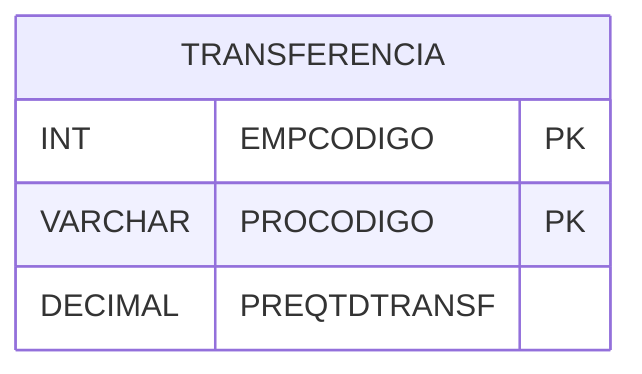

# TRANSFERENCIA - Documentação Completa de Relacionamentos

## 📊 Informações Gerais

- **Nome da Tabela**: TRANSFERENCIA (Transferência)
- **Total de Registros**: 1.068.822
- **Total de Colunas**: 3
- **Chave Primária**: EMPCODIGO, PROCODIGO (composite)
- **Chaves Estrangeiras**: 0
- **Índices**: 0
- **Tabelas Dependentes**: 0
- **Banco de Dados**: Firebird

## 📝 Descrição

**TRANSFERENCIA** é uma tabela de grande volume que armazena informações sobre transferências de produtos entre empresas. Com **1.068.822 registros**, esta tabela registra quantidades de produtos transferidas entre empresas do grupo.

Esta tabela é essencial para:
- **Transferências**: Gerenciar transferências entre empresas
- **Estoque**: Controlar estoque por empresa
- **Rastreamento**: Rastrear transferências realizadas
- **Relatórios**: Gerar relatórios de transferências

**Contexto de Negócio:**
Esta é uma das tabelas com maior volume do sistema, refletindo a grande quantidade de transferências de produtos entre empresas. É fundamental para controle de estoque e movimentações entre filiais.

---

## 🔑 Estrutura de Colunas

| Coluna | Tipo | Descrição |
|--------|------|-----------|
| **EMPCODIGO** 🔑 | INT | Código da empresa (PK) |
| **PROCODIGO** 🔑 | VARCHAR(14) | Código do produto (PK) |
| **PREQTDTRANSF** | DECIMAL(18,2) | Quantidade transferida |

---

## 🗺️ Diagrama de Relacionamentos



---

## 💡 Exemplos de Uso

### Consulta Básica

```sql
SELECT EMPCODIGO, PROCODIGO, PREQTDTRANSF
FROM TRANSFERENCIA
WHERE EMPCODIGO = ? AND PROCODIGO = ?;
```

### Consulta de Transferências por Empresa

```sql
SELECT 
    EMPCODIGO,
    COUNT(*) AS TOTAL_TRANSFERENCIAS,
    SUM(PREQTDTRANSF) AS QUANTIDADE_TOTAL
FROM TRANSFERENCIA
WHERE EMPCODIGO = ?
GROUP BY EMPCODIGO;
```

---

## ⚡ Performance e Otimização

### Índices Recomendados

#### 1. Índice Composto na Chave Primária (Já existe implicitamente)
```sql
-- Índice primário já existe implicitamente
```

#### 2. Índice em PROCODIGO
```sql
CREATE INDEX IDX_TRANSFERENCIA_PRODUTO 
ON TRANSFERENCIA (PROCODIGO);
```

**Justificativa:** Facilita buscas por produto.

---

## 📊 Estatísticas e Insights

- **Total de Registros**: 1.068.822
- **Volume**: Uma das tabelas com maior volume do sistema

---

**Documentação gerada em**: 2025-01-27

**Banco de dados**: Firebird

