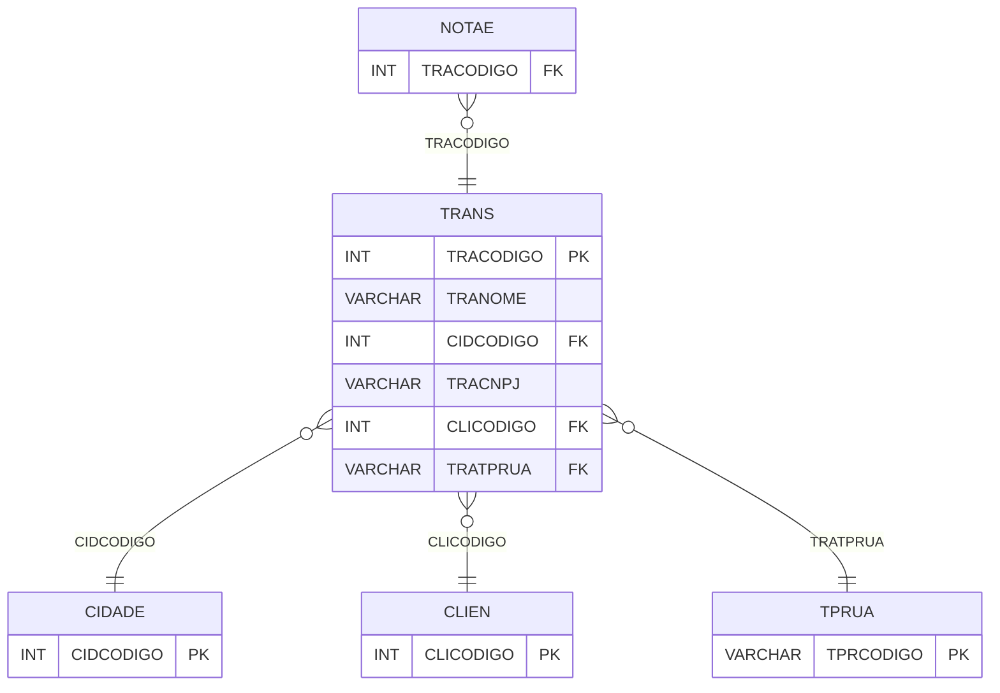

# TRANS - Documentação Completa de Relacionamentos

## 📊 Informações Gerais

- **Nome da Tabela**: TRANS (Transportadora)
- **Total de Registros**: 115
- **Total de Colunas**: 27
- **Chave Primária**: TRACODIGO
- **Chaves Estrangeiras**: 3
- **Índices**: 0
- **Tabelas Dependentes**: 4
- **Banco de Dados**: Firebird

## 📝 Descrição

**TRANS** é uma tabela mestre que armazena informações sobre transportadoras. Com **115 registros**, esta tabela registra dados completos de transportadoras, incluindo nome, CNPJ, inscrição estadual, endereço completo, telefones, e-mail, contato, observações, placa do veículo, RG, situação e link de rastreamento.

Esta tabela é essencial para:
- **Transporte**: Gerenciar transportadoras
- **Logística**: Armazenar dados de logística
- **Rastreamento**: Rastrear transportadoras disponíveis
- **Relatórios**: Gerar relatórios de transporte

---

## 🔑 Estrutura de Colunas (Principais)

| Coluna | Tipo | Descrição |
|--------|------|-----------|
| **TRACODIGO** 🔑 | INT | Código da transportadora (PK) |
| **TRANOME** | VARCHAR(37) | Nome da transportadora |
| **CIDCODIGO** 🔗 | INT | Código da cidade (FK → CIDADE) |
| **TRACNPJ** | VARCHAR(37) | CNPJ da transportadora |
| **TRAINSCEST** | VARCHAR(37) | Inscrição estadual |
| **TRATPRUA** 🔗 | VARCHAR(14) | Tipo de rua (FK → TPRUA) |
| **TRAENDERECO** | VARCHAR(37) | Endereço |
| **TRANR** | VARCHAR(37) | Número |
| **TRACOMPLE** | VARCHAR(37) | Complemento |
| **TRABAIRRO** | VARCHAR(37) | Bairro |
| **TRACEP** | VARCHAR(37) | CEP |
| **TRAFONE1** | VARCHAR(37) | Telefone 1 |
| **TRAFONE2** | VARCHAR(37) | Telefone 2 |
| **TRAFAX** | VARCHAR(37) | Fax |
| **TRAEMAIL** | VARCHAR(37) | E-mail |
| **CLICODIGO** 🔗 | INT | Código do cliente (FK → CLIEN) |
| **LINKRASTRE** | VARCHAR(37) | Link de rastreamento |

---

## 🔗 Relacionamentos - Nível 1 (Diretos)

### CIDADE - Cidade (FK Obrigatória)
**Volume:** Variável

**Relacionamento:**
```
TRANS.CIDCODIGO → CIDADE.CIDCODIGO (N:1)
Constraint: CIDADE_TRANS
```

### CLIEN - Cliente (FK Opcional)
**Volume:** Variável

**Relacionamento:**
```
TRANS.CLICODIGO → CLIEN.CLICODIGO (N:1)
Constraint: CLIEN_TRANS
```

### TPRUA - Tipo Rua (FK Opcional)
**Volume:** Variável

**Relacionamento:**
```
TRANS.TRATPRUA → TPRUA.TPRCODIGO (N:1)
Constraint: TPRUA_TRANS
```

---

## 📊 Tabelas que Referenciam Esta

Esta tabela é referenciada por 4 tabelas:

### CLIEMPCMP - Cliente Empresa Completo
**Volume:** Variável

**Relacionamento:**
```
CLIEMPCMP.TRACODIGO → TRANS.TRACODIGO (N:1)
Constraint: TRANS_CLIEMPCMP
```

### FAIXAFRETE - Faixa Frete
**Volume:** Variável

**Relacionamento:**
```
FAIXAFRETE.TRACODIGO → TRANS.TRACODIGO (N:1)
Constraint: FAIXAFRETE_TRANS
```

### NOTAE - Nota Fiscal Eletrônica
**Volume:** Variável

**Relacionamento:**
```
NOTAE.TRACODIGO → TRANS.TRACODIGO (N:1)
Constraint: TRANS_NOTAE
```

### PCTCLI - Pedido Cliente
**Volume:** Variável

**Relacionamento:**
```
PCTCLI.TRACODIGO → TRANS.TRACODIGO (N:1)
Constraint: TRANS_PCTCLI
```

---

## 🗺️ Diagrama de Relacionamentos



---

## 💡 Exemplos de Uso

### Consulta Básica

```sql
SELECT TRACODIGO, TRANOME, CIDCODIGO, TRACNPJ, TRAINSCEST, TRAENDERECO, TRAEMAIL
FROM TRANS
WHERE TRACODIGO = ?;
```

### Consulta com Informações da Cidade

```sql
SELECT 
    t.*,
    c.CIDNOME,
    u.UFNOME
FROM TRANS t
INNER JOIN CIDADE c
    ON t.CIDCODIGO = c.CIDCODIGO
INNER JOIN UF u
    ON c.CIDUF = u.UFCODIGO
WHERE t.TRACODIGO = ?;
```

---

## ⚡ Performance e Otimização

### Índices Recomendados

#### 1. Índice na Chave Primária (Já existe implicitamente)
```sql
-- Índice primário já existe implicitamente
```

#### 2. Índice em TRACNPJ
```sql
CREATE INDEX IDX_TRANS_CNPJ 
ON TRANS (TRACNPJ);
```

**Justificativa:** Facilita buscas por CNPJ.

---

## 📊 Estatísticas e Insights

- **Total de Registros**: 115
- **Transportadoras**: 115 transportadoras cadastradas

---

**Documentação gerada em**: 2025-01-27

**Banco de dados**: Firebird

