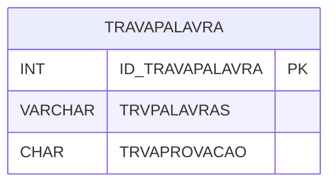

# TRAVAPALAVRA - Documentação Completa de Relacionamentos

## 📊 Informações Gerais

- **Nome da Tabela**: TRAVAPALAVRA (Trava Palavra)
- **Total de Registros**: 1
- **Total de Colunas**: 3
- **Chave Primária**: ID_TRAVAPALAVRA
- **Chaves Estrangeiras**: 0
- **Índices**: 0
- **Tabelas Dependentes**: 0
- **Banco de Dados**: Firebird

## 📝 Descrição

**TRAVAPALAVRA** é uma tabela de configuração que armazena palavras bloqueadas no sistema. Com apenas **1 registro**, esta tabela define palavras que não podem ser utilizadas em determinados contextos do sistema, incluindo configuração de aprovação.

Esta tabela é essencial para:
- **Segurança**: Bloquear palavras inadequadas
- **Configuração**: Armazenar configurações de bloqueio
- **Validação**: Validar entrada de dados

---

## 🔑 Estrutura de Colunas

| Coluna | Tipo | Descrição |
|--------|------|-----------|
| **ID_TRAVAPALAVRA** 🔑 | INT | Identificador único (PK) |
| **TRVPALAVRAS** | VARCHAR(261) | Lista de palavras bloqueadas |
| **TRVAPROVACAO** | CHAR(1) | Requer aprovação |

---

## 🗺️ Diagrama de Relacionamentos



---

## 💡 Exemplos de Uso

### Consulta Básica

```sql
SELECT ID_TRAVAPALAVRA, TRVPALAVRAS, TRVAPROVACAO
FROM TRAVAPALAVRA
WHERE ID_TRAVAPALAVRA = ?;
```

---

## ⚡ Performance e Otimização

### Índices Recomendados

#### 1. Índice na Chave Primária (Já existe implicitamente)
```sql
-- Índice primário já existe implicitamente
```

---

## 📊 Estatísticas e Insights

- **Total de Registros**: 1
- **Uso**: Tabela de configuração com volume mínimo

---

**Documentação gerada em**: 2025-01-27

**Banco de dados**: Firebird

