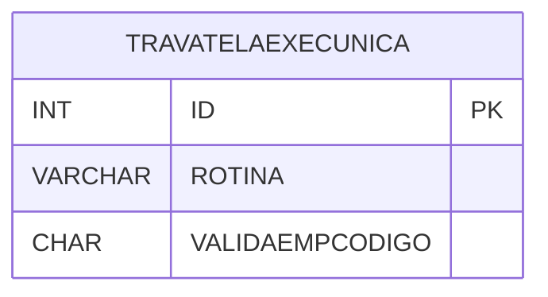

# TRAVATELAEXECUNICA - Documentação Completa de Relacionamentos

## 📊 Informações Gerais

- **Nome da Tabela**: TRAVATELAEXECUNICA (Trava Tela Execução Única)
- **Total de Registros**: 2
- **Total de Colunas**: 3
- **Chave Primária**: ID
- **Chaves Estrangeiras**: 0
- **Índices**: 0
- **Tabelas Dependentes**: 0
- **Banco de Dados**: Firebird

## 📝 Descrição

**TRAVATELAEXECUNICA** é uma tabela de configuração que armazena informações sobre rotinas que devem ser executadas apenas uma vez por empresa. Com apenas **2 registros**, esta tabela define quais rotinas têm execução única e devem validar o código da empresa.

Esta tabela é essencial para:
- **Controle**: Controlar execução única de rotinas
- **Configuração**: Armazenar configurações de execução
- **Validação**: Validar execução por empresa

---

## 🔑 Estrutura de Colunas

| Coluna | Tipo | Descrição |
|--------|------|-----------|
| **ID** 🔑 | INT | Identificador único (PK) |
| **ROTINA** | VARCHAR(37) | Nome da rotina |
| **VALIDAEMPCODIGO** | CHAR(1) | Valida código da empresa |

---

## 🗺️ Diagrama de Relacionamentos



---

## 💡 Exemplos de Uso

### Consulta Básica

```sql
SELECT ID, ROTINA, VALIDAEMPCODIGO
FROM TRAVATELAEXECUNICA
WHERE ROTINA = ?;
```

---

## ⚡ Performance e Otimização

### Índices Recomendados

#### 1. Índice na Chave Primária (Já existe implicitamente)
```sql
-- Índice primário já existe implicitamente
```

#### 2. Índice em ROTINA
```sql
CREATE INDEX IDX_TRAVATELAEXECUNICA_ROTINA 
ON TRAVATELAEXECUNICA (ROTINA);
```

**Justificativa:** Facilita buscas por rotina.

---

## 📊 Estatísticas e Insights

- **Total de Registros**: 2
- **Rotinas**: 2 rotinas com execução única configuradas

---

**Documentação gerada em**: 2025-01-27

**Banco de dados**: Firebird

